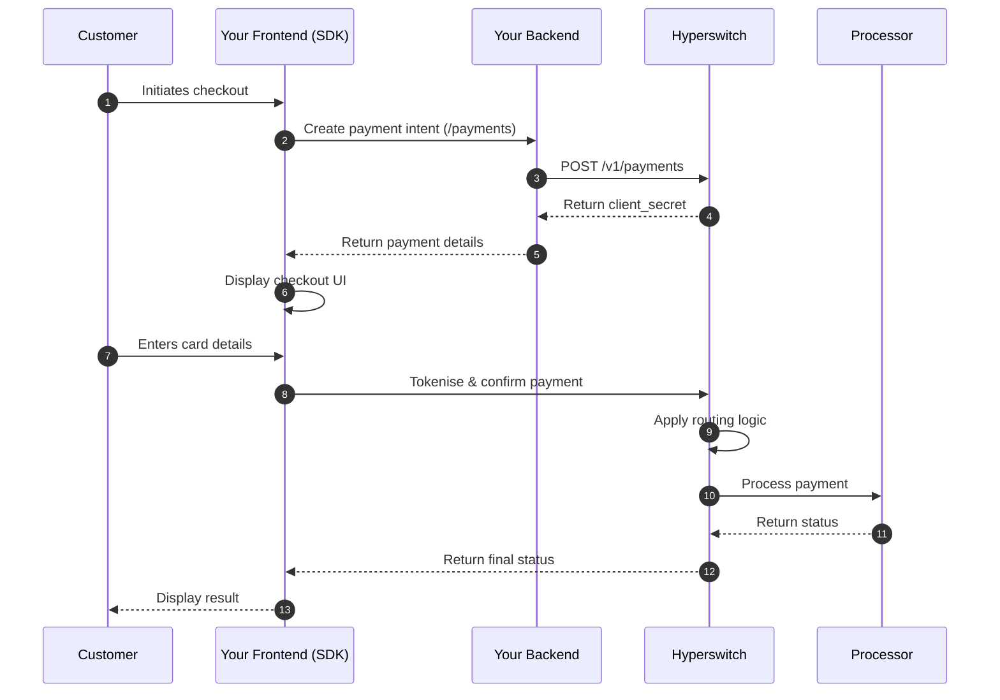

# Payment Suite

## TL;DR

Hyperswitch provides two integration models:

* **Model 1 (SDK)**: Frontend-driven, quick to implement, tokenises at payment time
* **Model 2 (S2S)**: Backend-driven, full control, tokenises before payment

**New to Hyperswitch?** Start with Model 1 for fastest time-to-production.

---

## What is the Payment Suite?

Hyperswitch is built for engineering teams that want granular control over their payment infrastructure. Rather than locking you into a single integration pattern, it provides a modular ecosystem that adapts to your compliance posture, performance requirements, and internal engineering capabilities.

The Payment Suite breaks payments into four independent building blocks. Each block can be Hyperswitch-managed, self-hosted by your team, or sourced from a third-party provider. This flexibility lets you design an architecture that meets your specific needs—whether you want rapid implementation or full infrastructure ownership.

---

## Prerequisites

Before integrating, ensure you have:

* [ ] **Hyperswitch Account** — Sign up at [dashboard.hyperswitch.io](https://app.hyperswitch.io)
* [ ] **API Keys** — `api-key` (server-side) and `publishable_key` (client-side)
* [ ] **Profile ID** — Created in dashboard (`pro_...`)
* [ ] **Connected Processor** — At least one PSP (Stripe, Adyen, etc.) configured
* [ ] **Webhook Endpoint** — Configured to receive asynchronous payment status updates

---

## The Four Core Components

| Component | Purpose | Ownership Options |
|-----------|---------|-------------------|
| **SDK (Frontend)** | Securely captures payment information in your frontend | Hyperswitch, self-hosted, or third-party |
| **Intelligent Routing & Orchestration (Backend)** | Manages payment lifecycle, routing logic, and post-payment operations | Hyperswitch or self-hosted |
| **Acquirer & Processor Connectivity (Connectors)** | Translates transactions to processor-specific formats | Hyperswitch, self-hosted, or third-party |
| **Vault (Card Data Storage)** | Securely stores card data for recurring payments | Hyperswitch, self-hosted, or external vault |

> 🔒 **PCI DSS Compliance Note**: The Vault is PCI DSS Level 1 compliant. Using the Vault SDK reduces your PCI compliance scope by keeping raw card data out of your systems.

**Need external vault integration?** See the [external vault setup guide](https://docs.hyperswitch.io/explore-hyperswitch/workflows/vault/connect-external-vaults-to-hyperswitch-orchestration).

---

## Which integration model should I choose?

Your integration choice depends on one question: who controls payment execution?

### Model 1 vs Model 2 Comparison

| Factor | Model 1: Client-Side Checkout | Model 2: Server-to-Server |
|--------|------------------------------|--------------------------|
| **Best For** | E-commerce, quick checkout | Subscriptions, B2B, complex flows |
| **Tokenisation Timing** | At payment time | Before payment |
| **Frontend Complexity** | Higher (SDK integration) | Lower (standard API calls) |
| **Backend Complexity** | Lower | Higher (orchestration logic) |
| **PCI Requirements** | Minimal (SDK handles sensitive data) | Required for direct API tokenisation |
| **Control** | SDK manages flow | Your backend controls timing |

**Decision Tree:**

* Need fastest implementation? → Model 1
* Need to charge saved cards later? → Model 2
* Already PCI compliant? → Either model works
* Building a subscription service? → Model 2 recommended

---

### Model 1: Client-Side Checkout (SDK-Driven)

**Tokenise post-payment | SDK-initiated execution**

Use this model when you want:

* Dynamic, frontend-driven payment experiences
* Minimal backend orchestration logic
* SDK-triggered payment confirmation
* Rapid checkout implementation

#### Prerequisites

* [ ] Hyperswitch account with API key
* [ ] SDK installed in your frontend application
* [ ] At least one connector configured in your Hyperswitch dashboard

#### SDK Code Example

```javascript
// Minimal SDK initialization
const hyper = window.Hyper('pk_live_...');
const widgets = hyper.widgets({ clientSecret: '...' });
widgets.create('payment').mount('#payment-element');
```

#### How does Model 1 work?



1. Your backend calls the [`/payments`](https://api-reference.hyperswitch.io/v1/payments/payments--create) API to create a payment intent
2. The [Checkout SDK](https://docs.hyperswitch.io/explore-hyperswitch/payment-experience/payment) loads in your frontend
3. The SDK securely collects payment details
4. The SDK triggers payment confirmation
5. The SDK communicates with the Hyperswitch backend
6. Hyperswitch applies [routing logic](https://docs.hyperswitch.io/explore-hyperswitch/workflows/intelligent-routing), sends the request to the configured processor, manages authorisation and capture, then returns the final payment status

> 🔔 **Webhook & Error Handling**: Payment processing is asynchronous. Configure [webhooks](https://docs.hyperswitch.io/explore-hyperswitch/webhooks) to receive final status updates and handle errors such as failed payments or timeouts.

> 🔀 **API Version Note**: This guide uses v1 for payments and v2 for payment methods. Both versions are stable; refer to the [API Versioning Guide](https://docs.hyperswitch.io/api-reference) for guidance on version selection.

---

### Model 2: Server-to-Server (Backend-Driven)

**Tokenise pre-payment | Backend-controlled execution**

Use this model when you want:

* Granular control over transaction timing
* Backend-driven orchestration logic
* Tokenised credentials before execution
* Decoupled vaulting from transaction processing

#### Prerequisites

* [ ] Hyperswitch account with API key
* [ ] Backend server capable of making API calls
* [ ] At least one connector configured

#### Step 1: Tokenise the payment method

> ⚠️ **PCI Compliance**: Direct API tokenisation requires PCI compliance. Non-PCI merchants should use the [Vault SDK](https://docs.hyperswitch.io/explore-hyperswitch/payment-experience/payment-method/web) instead.

Tokenise payment credentials using either:

* [Vault SDK](https://docs.hyperswitch.io/explore-hyperswitch/payment-experience/payment-method/web) (frontend)
* Backend call to [`/payment-methods`](https://api-reference.hyperswitch.io/v2/payment-methods/payment-method--create-v1) API

Hyperswitch securely stores the credential and returns a reusable identifier: `payment_method_id`.

#### Step 2: Trigger payment execution

**Option A: Full Hyperswitch orchestration**

Use this option if you want Hyperswitch to:

* Apply [routing logic](https://docs.hyperswitch.io/explore-hyperswitch/workflows/intelligent-routing)
* Select the optimal connector
* Manage [retries](https://docs.hyperswitch.io/explore-hyperswitch/workflows/smart-retries) and failover
* Handle the authorisation and capture lifecycle

Call the `/payments` API with the `payment_method_id`:

```json
{
  "amount": 1000,
  "currency": "USD",
  "payment_method_id": "pm_abc123xyz",
  "confirm": true
}
```

> **Recommended:** This is the recommended model for merchants adopting Hyperswitch orchestration.

**Option B: Proxy API (incremental migration)**

Use this option if:

* You do not want to change your existing processor integration immediately
* You want Hyperswitch to act as a passthrough layer
* You are incrementally migrating to full orchestration

Call the [`/proxy`](https://docs.hyperswitch.io/about-hyperswitch/payment-suite-1/payment-method-card/proxy) API:

```
POST https://sandbox.hyperswitch.io/proxy
Headers: api-key, profile_id
Body: {
  "request_body": {...},
  "destination_url": "...",
  "method": "POST",
  "headers": {...},
  "token_type": "...",
  "token": "..."
}
```

In this mode:

* Your existing integration contract remains unchanged
* Hyperswitch forwards requests to the configured processor
* You can progressively enable routing and orchestration features

> 🔔 **Webhook & Error Handling**: Both models use asynchronous processing. Configure [webhooks](https://docs.hyperswitch.io/explore-hyperswitch/webhooks) to receive final payment status updates and handle scenarios such as `payment_method_id` expiration or routing failures.

---

## What can go wrong?

| Scenario | Symptom | Resolution |
|----------|---------|------------|
| Payment stuck in `requires_confirmation` | Customer abandoned checkout | Implement webhook handling for status updates |
| `payment_method_id` not found | Token expired or deleted | Re-tokenise the payment method |
| Routing fails with no connector selected | No eligible connector for currency/amount | Check connector configuration and routing rules |
| 401 Unauthorized | Invalid API key | Verify your API key in the Hyperswitch dashboard |

---

## How do I test my integration?

Use the Hyperswitch sandbox environment to test before going live:

1. Create a sandbox account at [sandbox.hyperswitch.io](https://sandbox.hyperswitch.io)
2. Configure a test connector (Stripe test mode recommended for beginners)
3. Use test card numbers:
   * **Visa:** `4242 4242 4242 4242`
   * **Mastercard:** `5555 5555 5555 4444`
   * **Decline:** `4000 0000 0000 0002`

See the [testing guide](https://docs.hyperswitch.io/explore-hyperswitch/payment-experience/test-a-payment) for complete test scenarios.

---

## What's next?

Ready to implement? Choose your path:

* **[Quick start with SDK](https://docs.hyperswitch.io/explore-hyperswitch/payment-experience/payment)** — Get a checkout running in minutes
* **[Set up intelligent routing](https://docs.hyperswitch.io/explore-hyperswitch/workflows/intelligent-routing)** — Optimise processor selection
* **[Configure your first connector](https://docs.hyperswitch.io/explore-hyperswitch/payment-experience/connectors)** — Connect to your payment processor
* **[Explore vault options](https://docs.hyperswitch.io/explore-hyperswitch/workflows/vault)** — Enable one-click payments

---

## Related Features

* [Smart retries](https://docs.hyperswitch.io/explore-hyperswitch/workflows/smart-retries) — Automatic retry logic for failed payments
* [Recurring payments](https://docs.hyperswitch.io/explore-hyperswitch/payment-experience/recurring-payments) — Set up subscriptions and stored credentials
* [Webhooks](https://docs.hyperswitch.io/explore-hyperswitch/webhooks) — Real-time event notifications
* [Disputes](https://docs.hyperswitch.io/explore-hyperswitch/workflows/disputes) — Handle chargebacks and inquiries
