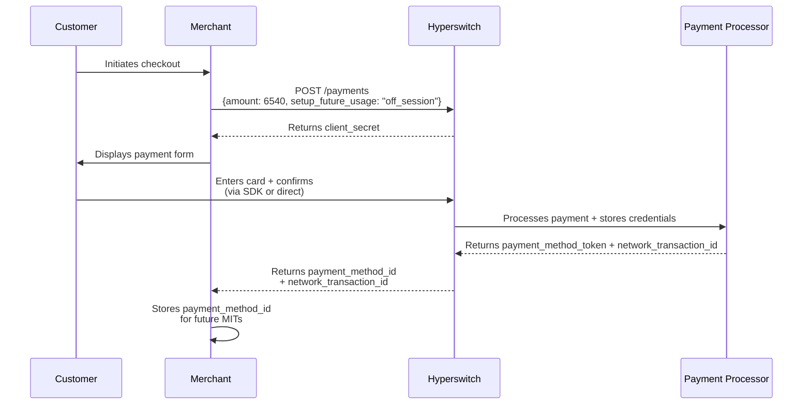
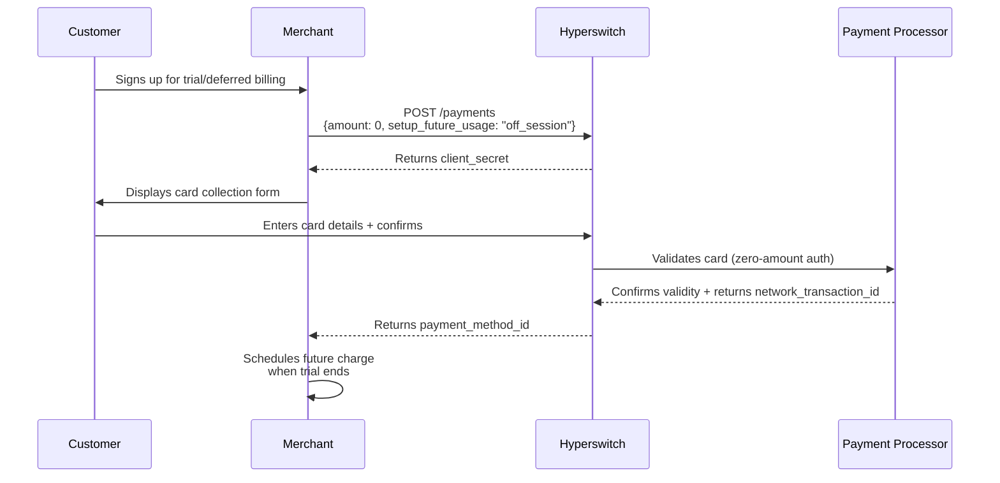
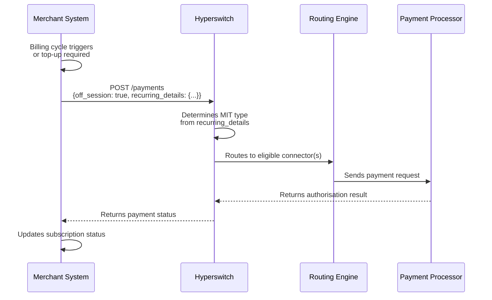
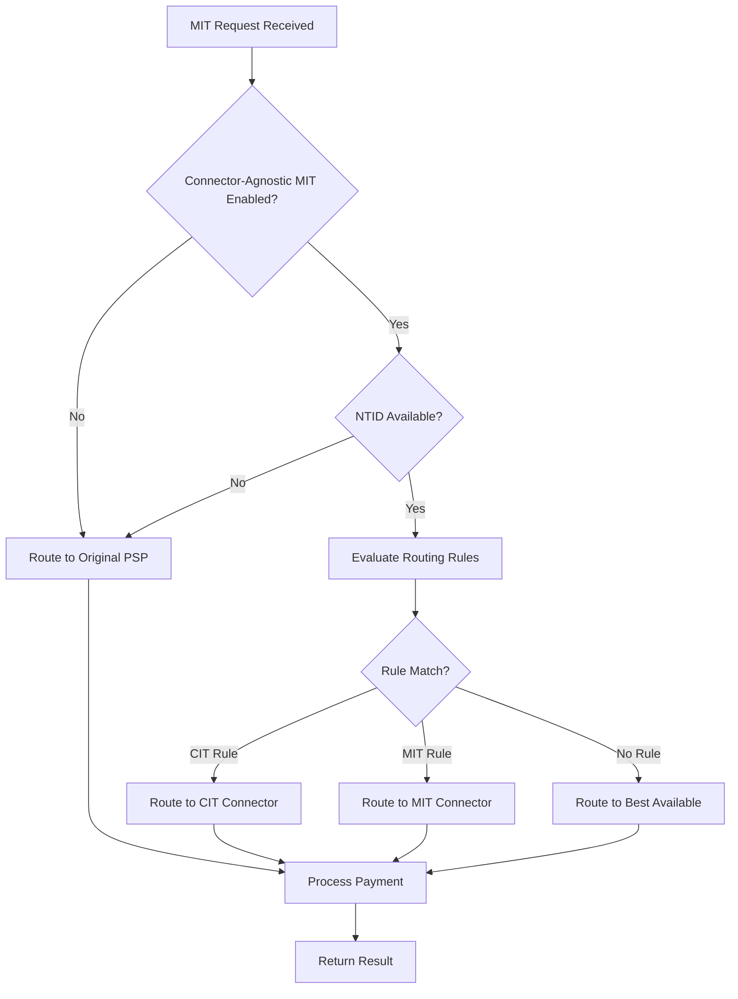

# Recurring Payments

## TL;DR

Set up and process recurring card payments with Hyperswitch using Customer-Initiated Transactions (CIT) and Merchant-Initiated Transactions (MIT). Store payment credentials once, charge customers automatically for subscriptions, free trials, or deferred billing. Supports connector-agnostic routing to maximise authorisation rates and minimise vendor lock-in.

**Key Value Propositions:**
- **One-time setup**: Store credentials securely with CIT, charge repeatedly with MIT
- **Zero-dollar authorisation**: Validate cards without immediate charges (perfect for free trials)
- **Connector flexibility**: Route MITs through any supported PSP, not just the original token provider
- **Compliance ready**: Built-in support for network transaction IDs (NTID) and PCI-compliant tokenisation

---

## Prerequisites Checklist

Before implementing recurring payments, ensure you have:

- [ ] **Hyperswitch Account**: Active merchant account with API credentials
- [ ] **Business Profile**: Configured profile ID for your payment flows
- [ ] **API Key**: Valid Hyperswitch API key for authentication
- [ ] **SDK Integration** (optional): Hyperswitch SDK configured with `displaySavedPaymentMethodsCheckbox` enabled
- [ ] **PSP Configuration**: MIT exemption enabled with your payment processor(s)
- [ ] **Compliance Setup**: Customer consent capture mechanism in place
- [ ] **Webhook Endpoint**: Configured to receive payment status updates

---

## What Is the Difference Between CIT and MIT?

| Aspect | Customer-Initiated Transaction (CIT) | Merchant-Initiated Transaction (MIT) |
|--------|--------------------------------------|--------------------------------------|
| **Who initiates** | Customer (cardholder) | Merchant (your system) |
| **Customer present** | Yes, actively authenticates | No, fully automated |
| **Authentication** | 3DS, biometrics, or other SCA | Uses stored credentials, no SCA |
| **Typical use** | First payment, subscription setup | Recurring charges, top-ups |
| **Required parameters** | `setup_future_usage: "off_session"` | `off_session: true`, `recurring_details` |
| **Amount** | Can be zero (setup) or positive | Always positive |
| **Result** | Stores `payment_method_id` | Charges using stored credentials |

---

## How Do I Set Up Recurring Payments with an Immediate Charge?

Use this flow when you need to collect payment immediately (e.g., first month of a subscription or a setup fee) whilst simultaneously saving card details for future automatic charges.

### CIT Setup Flow



### Required API Configuration

Include the following parameters when calling the [Payments API](https://api-reference.hyperswitch.io/v1/payments/payments--create):

| Parameter | Value | Description |
|-----------|-------|-------------|
| `amount` | > 0 (greater than zero) | Charge amount in smallest currency unit |
| `setup_future_usage` | `"off_session"` | Indicates credentials stored for off-session use |
| `customer_id` | Your customer identifier | Links payment method to customer |

### Run-Ready API Example (CIT with Charge)

```json
curl --location 'https://sandbox.hyperswitch.io/payments' \
--header 'Content-Type: application/json' \
--header 'Accept: application/json' \
--header 'api-key: <your_hyperswitch_api_key>' \
--data-raw '{
    "amount": 6540,
    "currency": "USD",
    "profile_id": "<your_profile_id>",
    "setup_future_usage": "off_session",
    "customer_id": "customer123",
    "description": "First payment with card storage",
    "return_url": "https://example.com/payment-complete"
}'
```

---

## How Do I Validate a Card Without Charging?

Use Zero Dollar Authorization for free trials, pay-later models, or delayed billing. This flow validates payment method details without charging the customer's card.

### Zero Dollar Auth Flow



### Required API Configuration

Pass these parameters when calling the Payments API for [Zero Dollar Authorisation](https://docs.hyperswitch.io/explore-hyperswitch/payment-orchestration/quickstart/tokenization-and-saved-cards/zero-amount-authorization-1):

| Parameter | Value | Description |
|-----------|-------|-------------|
| `amount` | `0` | Zero amount for validation only |
| `setup_future_usage` | `"off_session"` | Stores credentials for future use |
| `confirm` | `false` (optional) | Create session, confirm separately |

### Run-Ready API Example (Zero Auth Mandate)

```json
curl --location 'https://sandbox.hyperswitch.io/payments' \
--header 'Content-Type: application/json' \
--header 'Accept: application/json' \
--header 'api-key: <your_hyperswitch_api_key>' \
--data-raw '{
    "amount": 0,
    "currency": "USD",
    "confirm": false,
    "customer_id": "zero_auth_customer",
    "email": "customer@example.com",
    "name": "John Doe",
    "phone": "999999999",
    "phone_country_code": "+1",
    "description": "Zero dollar authorisation for trial",
    "profile_id": "<your_profile_id>",
    "setup_future_usage": "off_session"
}'
```

---

## What Happens After a Successful CIT?

After a successful CIT, Hyperswitch returns:

| Field | Description | Usage |
|-------|-------------|-------|
| `payment_method_id` | Unique identifier for the stored payment method | Use for all subsequent MIT payments |
| `network_transaction_id` | Scheme-level transaction identifier | Enables cross-processor recurring payments |

### Understanding `payment_method_id`

The `payment_method_id` serves as a unique identifier mapped to a specific combination of a Customer ID and a unique Payment Instrument (e.g., a specific credit card, digital wallet, or bank account). A single customer can have multiple payment methods, each assigned a distinct ID. However, the same payment instrument used by the same customer will always resolve to the same `payment_method_id`. This uniqueness applies across all payment types, including cards, wallets, and bank details.

| Customer ID | Payment Instrument | Payment Method ID |
|-------------|-------------------|-------------------|
| 123 | Visa ending in 4242 | `PM1` |
| 123 | Mastercard ending in 1111 | `PM2` |
| 456 | Visa ending in 4242 | `PM3` |
| 123 | PayPal Account (`user@email.com`) | `PM4` |

Internally, the `payment_method_id` maps to various credentials: PSP token, raw card + NTID, or network token + NTID, depending on enabled functionalities for the merchant.

---

## How Do I Capture Customer Consent?

### Without Hyperswitch SDK

If you are not using the Hyperswitch SDK, you must include `customer_acceptance` (customer's consent) in the [confirm](https://api-reference.hyperswitch.io/v1/payments/payments--confirm) request:

```json
{
    "customer_acceptance": {
        "acceptance_type": "online",
        "accepted_at": "2024-01-15T10:30:00.000Z",
        "online": {
            "ip_address": "203.0.113.1",
            "user_agent": "Mozilla/5.0 (Windows NT 10.0; Win64; x64)"
        }
    }
}
```

### With Hyperswitch SDK

If you are using the Hyperswitch SDK, `customer_acceptance` is sent automatically in the confirm request based on the customer selecting the save card option.

**Note:** Enable this functionality using the [`displaySavedPaymentMethodsCheckbox`](https://docs.hyperswitch.io/hyperswitch-cloud/integration-guide/web/customization#id-6.-handle-saved-payment-methods) property during SDK integration.

---

## How Do I Process Merchant-Initiated Transactions?

Hyperswitch supports decoupled transaction flows, allowing MITs to process independently of the original CIT, even when the CIT completed outside the Hyperswitch platform.

### MIT Execution Flow



Initiate MITs by calling the [`/payments`](https://api-reference.hyperswitch.io/v1/payments/payments--create) API with `off_session: true` and providing available reference data in the `recurring_details` object. Depending on available artifacts, use one of these approaches:

### Option 1: Payment Method ID

Submit the Hyperswitch-generated `payment_method_id` to process the MIT transaction. Depending on merchant configurations, the MIT processes with the same PSP or a different PSP.

```json
{
    "amount": 5000,
    "currency": "USD",
    "off_session": true,
    "recurring_details": {
        "type": "payment_method_id",
        "data": "<payment_method_id_from_cit>"
    }
}
```

### Option 2: Processor Payment Token

Submit a processor-issued token representing the previously authorised payment instrument.

```json
{
    "amount": 5000,
    "currency": "USD",
    "off_session": true,
    "recurring_details": {
        "type": "processor_token",
        "data": "<psp_token>"
    }
}
```

### Option 3: Network Transaction ID with Card Data

Provide the original network transaction identifier along with associated primary card data required for authorisation.

```json
{
    "amount": 5000,
    "currency": "USD",
    "off_session": true,
    "recurring_details": {
        "type": "network_transaction_id_and_card_details",
        "data": {
            "card_number": "4242424242424242",
            "exp_month": "12",
            "exp_year": "2027",
            "network_transaction_id": "<ntid_from_cit>"
        }
    }
}
```

### Option 4: Network Transaction ID with Network Token

Submit the network transaction identifier with corresponding network tokenised card credentials.

### Option 5: Limited Card Data

Use a reduced card data set captured at subscription creation to authorise subsequent MITs.


**PSP Configuration Required**

This feature is not enabled by default and must be explicitly enabled by your PSP.

You may receive errors such as `Received unknown parameter: payment_method_options[card][mit_exemption]`. Follow these steps to request activation:

Email PSP Support requesting:
- Access to the `mit_exemption` parameter for MIT (Merchant Initiated Transaction) payments
- Ability to pass `network_transaction_id` in the parameter: `payment_method_options[card][mit_exemption][network_transaction_id]`
- Explain your use case: enabling cross-processor MIT payments using network transaction IDs from card schemes


---

## How Does Connector-Agnostic MIT Routing Work?

Traditional recurring payments use the PSP token from the original CIT, creating connector stickiness—all recurring payments must route through the token-issuing connector.

Hyperswitch stores the Network Transaction ID as a chaining identifier for the CIT where the payment method was saved. In subsequent MIT payments, based on feature enablement and NTID availability, Hyperswitch routes payments to the eligible set of connectors (also used for retries).

### Connector-Agnostic Routing Flow



### Enabling Connector-Agnostic MITs

To start routing MIT payments across all supported connectors in addition to the connector through which the recurring payment was set up, use this API:

```bash
curl --location 'https://sandbox.hyperswitch.io/account/:merchant_id/business_profile/:profile_id/toggle_connector_agnostic_mit' \
--header 'Content-Type: application/json' \
--header 'Accept: application/json' \
--header 'api-key: <your_api_key>' \
--data '{
    "enabled": true
}'
```

All payment methods saved with `setup_future_usage: "off_session"` after enabling this feature become eligible for routing across the list of supported connectors during subsequent MIT payments.

---

## How Do I Configure Routing Rules for CIT and MIT?

The [Hyperswitch Dashboard](https://app.hyperswitch.io/dashboard/routing/rule) provides a UI to configure routing rules for PG-agnostic recurring payments. Select the profile for which you wish to configure the rule in the Smart Routing Configuration.

Configure the rule using the metadata field in Rule-Based Configuration:


This rule works in conjunction with other active routing rules you have configured.

Once configured, send the following metadata in payment requests:

### Metadata for CITs

```json
{
    "metadata": {
        "is_cit": "true"
    }
}
```

### Metadata for MITs

```json
{
    "metadata": {
        "is_mit": "true"
    }
}
```

According to the configured rule, all CITs for the specific business profile route through Stripe, and MITs route through Adyen.

---

## Error Reference Table

| Error Code | Message | Cause | Resolution |
|------------|---------|-------|------------|
| `RE_01` | `Received unknown parameter: payment_method_options[card][mit_exemption]` | MIT exemption not enabled with PSP | Contact your PSP to enable `mit_exemption` parameter |
| `RE_02` | `Invalid payment_method_id` | Payment method ID does not exist or was deleted | Verify the payment method ID; re-collect if necessary |
| `RE_03` | `Network transaction ID not found` | NTID not available for this payment method | Ensure CIT completed successfully; check PSP supports NTID |
| `RE_04` | `Customer acceptance required` | Missing `customer_acceptance` in confirm request | Include customer consent details when not using SDK |
| `RE_05` | `Off-session payments not enabled` | `setup_future_usage: "off_session"` not set during CIT | Recreate payment with correct setup parameter |
| `RE_06` | `Connector agnostic MIT not enabled` | Feature flag disabled for business profile | Call toggle API to enable connector-agnostic MIT |
| `RE_07` | `Invalid recurring_details type` | Unsupported value in `recurring_details.type` | Use valid type: `payment_method_id`, `processor_token`, etc. |
| `RE_08` | `Card expired` | Stored card has expired | Request customer update card details; use account updater if available |
| `RE_09` | `Insufficient funds` | Card has insufficient balance | Retry after delay or notify customer to fund account |
| `RE_10` | `3DS required` | MIT blocked due to SCA requirement | Verify NTID validity; check PSP configuration for MIT exemption |

---

## Quick Reference

### API Endpoints

| Purpose | Endpoint | Method |
|---------|----------|--------|
| Create CIT | `/payments` | POST |
| Confirm CIT | `/payments/{id}/confirm` | POST |
| Create MIT | `/payments` | POST |
| Toggle connector-agnostic MIT | `/account/{merchant_id}/business_profile/{profile_id}/toggle_connector_agnostic_mit` | POST |

### Key Parameters Summary

| Parameter | CIT Setup | Zero Auth | MIT | Description |
|-----------|-----------|-----------|-----|-------------|
| `setup_future_usage` | `"off_session"` | `"off_session"` | N/A | Stores credentials for off-session use |
| `off_session` | N/A | N/A | `true` | Indicates MIT without customer present |
| `amount` | > 0 | `0` | > 0 | Transaction amount |
| `recurring_details` | N/A | N/A | Required | Specifies stored credential to use |
| `customer_acceptance` | Required* | Required* | N/A | Customer consent for storage |

\* Required when not using Hyperswitch SDK

---

## Next Steps

- Review the [Payments API Reference](https://api-reference.hyperswitch.io/v1/payments) for complete parameter documentation
- Configure [Webhooks](https://docs.hyperswitch.io/hyperswitch-cloud/integration-guide/webhooks) to receive real-time payment status updates
- Set up [Retry Logic](https://docs.hyperswitch.io/explore-hyperswitch/payment-orchestration/smart-router) for failed MITs
- Explore [Network Tokenisation](https://docs.hyperswitch.io/explore-hyperswitch/payment-orchestration/tokenization-and-saved-cards) for enhanced security
