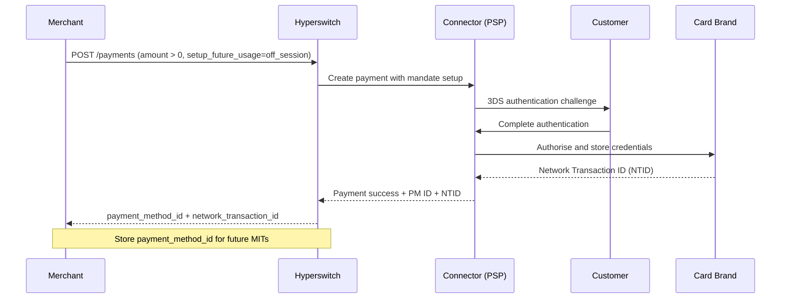
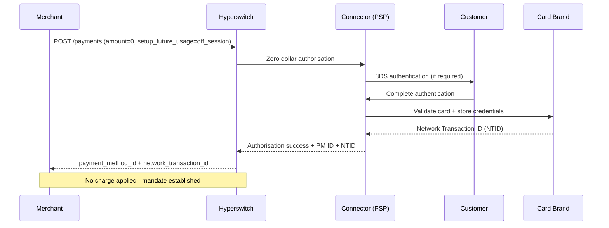
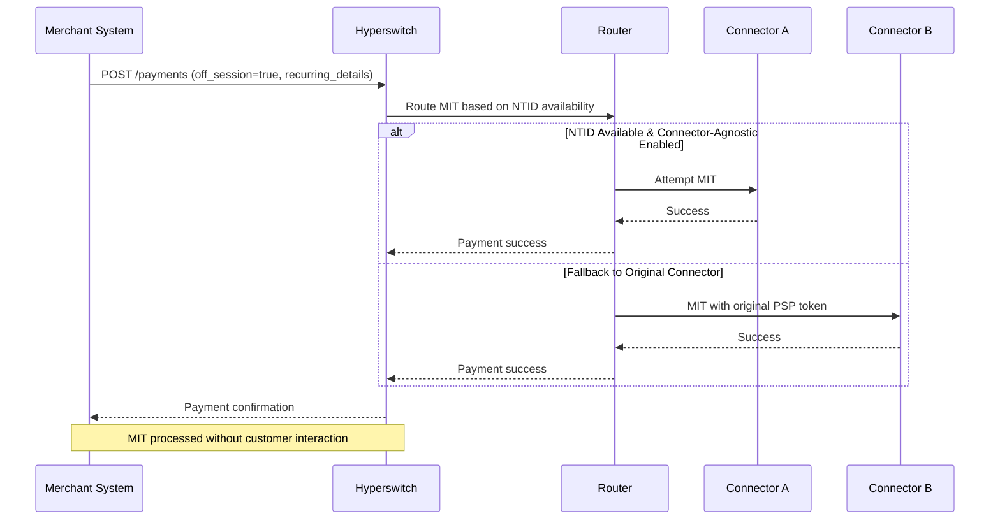
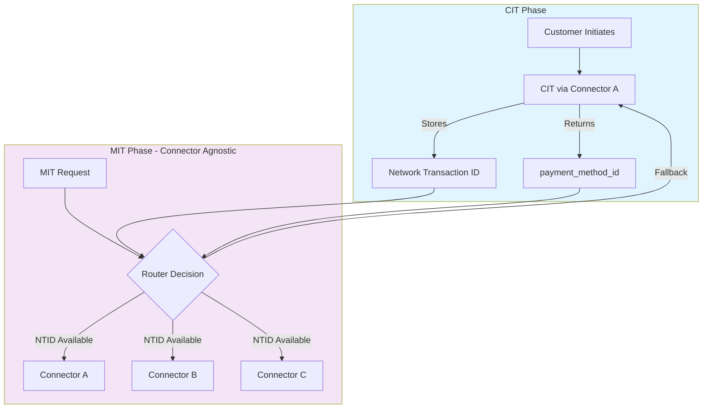

# Recurring Payments

> **TL;DR:** Set up flexible, compliant recurring payments with Hyperswitch using CIT/MIT flows. Charge immediately or validate cards for later, then process merchant-initiated transactions across any supported connector using network transaction IDs—eliminating PSP lock-in.

## What You'll Learn

- How to set up recurring payments using Customer-Initiated Transactions (CIT)
- When to use charge vs zero-dollar authorisation flows
- How to execute Merchant-Initiated Transactions (MIT) for subsequent payments
- How connector-agnostic routing enables payment processor flexibility

---

## Overview

Recurring payments via Hyperswitch enable you to charge customers on a flexible schedule without being tied to fixed amounts or billing cycles. The implementation follows a two-phase model: first, you capture customer consent through a Customer-Initiated Transaction (CIT), then you process subsequent charges through Merchant-Initiated Transactions (MITs).

This approach gives you complete control over billing timing and amounts whilst maintaining compliance with card scheme requirements for stored credential transactions.

---

## CIT vs MIT: Understanding the Difference

| Aspect | Customer-Initiated Transaction (CIT) | Merchant-Initiated Transaction (MIT) |
|--------|--------------------------------------|--------------------------------------|
| **Who initiates** | Customer actively participates | Merchant triggers automatically |
| **Customer presence** | Customer is on-session (present) | Customer is off-session (not present) |
| **Purpose** | Set up mandate + optional first charge | Process subsequent recurring charges |
| **Authentication** | Full SCA/3DS authentication required | Uses stored credentials from CIT |
| **API flag** | `setup_future_usage: "off_session"` | `off_session: true` |
| **Compliance** | Captures customer consent explicitly | Relies on consent captured during CIT |

---

## Phase 1: Setting Up Recurring Payments (CIT)

When establishing a recurring payment arrangement, you must first complete a Customer-Initiated Transaction. This transaction captures the customer's consent to store their payment method for future off-session charges. The CIT serves as the foundation for all subsequent MIT payments and must be completed with the customer present.

There are two implementation flows for the CIT phase, each suited to different business scenarios.

### Option 1: CIT with Immediate Charge

**When to use this flow:** Use this approach when you need to collect payment immediately whilst simultaneously saving card details for future automatic charges. Common scenarios include the first month of a subscription, a setup fee, or an initial purchase that precedes a recurring service.

**How it works:** You create a payment with a non-zero amount and set `setup_future_usage` to `off_session`. The customer completes authentication (including 3DS if required), their payment method is stored, and you receive both the payment and a `payment_method_id` for future charges.

#### Required Parameters

| Parameter | Value | Description |
|-----------|-------|-------------|
| `amount` | > 0 | Any positive value in minor units (e.g., 6540 = $65.40) |
| `setup_future_usage` | `"off_session"` | Signals intent to store payment method for MIT |
| `customer_id` | Your identifier | Links payment method to a specific customer |
| `return_url` | Valid URL | Required for 3DS redirect handling |

#### API Example

```bash
curl --location 'https://sandbox.hyperswitch.io/payments' \
--header 'Content-Type: application/json' \
--header 'Accept: application/json' \
--header 'api-key: YOUR_API_KEY' \
--data-raw '{
    "amount": 6540,
    "currency": "USD",
    "profile_id": "YOUR_PROFILE_ID",
    "setup_future_usage": "off_session",
    "customer_id": "customer123",
    "description": "Initial subscription payment",
    "return_url": "https://example.com/return"
}'
```

#### CIT with Charge Flow



---

### Option 2: Zero Dollar Authorisation (Mandate-Only Setup)

**When to use this flow:** Use this approach for free trials, pay-later models, or scenarios where you need to validate a payment method without charging the customer. This flow confirms the card is valid and sets up the mandate for future charges.

**How it works:** You create a zero-amount authorisation request that validates the payment method details. The customer completes authentication, and you receive a `payment_method_id` for future MIT charges—without any money changing hands.

#### Required Parameters

| Parameter | Value | Description |
|-----------|-------|-------------|
| `amount` | `0` | Zero amount for validation only |
| `setup_future_usage` | `"off_session"` | Signals intent to store payment method |
| `payment_type` | `"payment_type"` | Required for zero-dollar auth |

#### API Example

```bash
curl --location 'https://sandbox.hyperswitch.io/payments' \
--header 'Content-Type: application/json' \
--header 'Accept: application/json' \
--header 'api-key: YOUR_API_KEY' \
--data-raw '{
    "amount": 0,
    "currency": "USD",
    "confirm": false,
    "customer_id": "trial_customer_001",
    "email": "customer@example.com",
    "name": "John Doe",
    "phone": "9999999999",
    "phone_country_code": "+1",
    "description": "Free trial mandate setup",
    "profile_id": "YOUR_PROFILE_ID",
    "setup_future_usage": "off_session"
}'
```

#### Zero Dollar Auth Flow



---

## What You Receive After a Successful CIT

Upon successful completion of either CIT flow, Hyperswitch returns critical identifiers that enable subsequent MIT processing.

### The `payment_method_id`

This identifier uniquely maps to a specific combination of customer and payment instrument. A single customer can have multiple payment methods, each with its own ID, but the same payment instrument for the same customer always resolves to the same `payment_method_id`.

| Customer ID | Payment Instrument | Payment Method ID |
|-------------|-------------------|-------------------|
| `cust_123` | Visa ending in 4242 | `pm_Visa_4242_123` |
| `cust_123` | Mastercard ending in 1111 | `pm_MC_1111_123` |
| `cust_456` | Visa ending in 4242 | `pm_Visa_4242_456` |
| `cust_123` | PayPal (user@email.com) | `pm_PP_123` |

Internally, Hyperswitch maps the `payment_method_id` to various credentials including PSP tokens, raw card data with NTID, and network tokens—depending on your merchant configuration.

### The `network_transaction_id` (NTID)

The Network Transaction ID serves as a chaining identifier that links the original CIT to subsequent MIT payments. This identifier enables connector-agnostic routing and cross-processor MIT execution, which is essential for payment processor flexibility.

---

## Customer Consent Capture (Mandate Compliance)

Capturing customer consent is a regulatory requirement for storing payment methods. The approach differs depending on your integration method.

### Using Hyperswitch SDK

The SDK handles consent capture automatically. When customers click the "Save card" checkbox, the SDK includes `customer_acceptance` in the confirm request. Enable this functionality by setting `displaySavedPaymentMethodsCheckbox: true` during SDK integration.

### Without SDK (Direct API Integration)

You must explicitly provide customer acceptance details in your confirm request:

```json
{
    "customer_acceptance": {
        "acceptance_type": "online",
        "accepted_at": "2026-03-06T10:30:00.000Z",
        "online": {
            "ip_address": "192.168.1.100",
            "user_agent": "Mozilla/5.0 (Windows NT 10.0; Win64; x64)"
        }
    }
}
```

---

## Phase 2: Executing Merchant-Initiated Transactions (MIT)

Once you've completed a CIT and stored the payment method, you can process subsequent charges without customer interaction. MITs are initiated by your system using the credentials established during the CIT.

Hyperswitch supports decoupled transaction flows, allowing MITs to be processed independently of the original CIT—even when that CIT occurred outside Hyperswitch.

### Required Parameters for MIT

| Parameter | Value | Description |
|-----------|-------|-------------|
| `off_session` | `true` | Indicates merchant-initiated transaction |
| `recurring_details` | Object | Contains reference to stored credentials |

### MIT Execution Methods

Depending on what credentials you have available, choose the appropriate method:

#### Method 1: Payment Method ID (Recommended)

Submit the Hyperswitch-generated `payment_method_id` from the original CIT:

```json
{
    "amount": 2999,
    "currency": "USD",
    "customer_id": "customer123",
    "off_session": true,
    "recurring_details": {
        "payment_method_id": "pm_Visa_4242_123"
    }
}
```

#### Method 2: Processor Payment Token

Submit a processor-issued token directly:

```json
{
    "amount": 2999,
    "currency": "USD",
    "off_session": true,
    "recurring_details": {
        "processor_payment_token": "tok_live_abc123xyz"
    }
}
```

#### Method 3: Network Transaction ID with Card Data

Provide the NTID along with card details for cross-processor MIT:

```json
{
    "amount": 2999,
    "currency": "USD",
    "off_session": true,
    "payment_method": "card",
    "payment_method_data": {
        "card": {
            "card_number": "4242424242424242",
            "exp_month": "12",
            "exp_year": "2028"
        }
    },
    "payment_method_options": {
        "card": {
            "mit_exemption": {
                "network_transaction_id": "123456789012345"
            }
        }
    }
}
```

#### MIT Execution Flow



### PSP Configuration for Network Transaction ID


**PSP Configuration Required:** The NTID-based MIT feature requires explicit enablement by your PSP. If you encounter errors like `Received unknown parameter: payment_method_options[card][mit_exemption]`, contact your PSP support.

**Request the following:**
- Access to the `mit_exemption` parameter for MIT payments
- Ability to pass `network_transaction_id` in payment requests
- Explanation that your use case involves cross-processor MIT using scheme NTIDs


---

## Connector-Agnostic MIT Routing

Traditional recurring payment implementations create connector lock-in: the MIT must use the same processor that issued the token during the CIT. Hyperswitch solves this through connector-agnostic routing using Network Transaction IDs.

### How It Works

When connector-agnostic MIT routing is enabled, Hyperswitch stores the NTID from the CIT as a chaining identifier. For subsequent MIT payments, the system can route to any supported connector that accepts NTID-based transactions—not just the original processor.



### Enabling Connector-Agnostic MITs

Enable this feature for a business profile using the toggle API:

```bash
curl --location 'https://sandbox.hyperswitch.io/account/:merchant_id/business_profile/:profile_id/toggle_connector_agnostic_mit' \
--header 'Content-Type: application/json' \
--header 'Accept: application/json' \
--header 'api-key: YOUR_API_KEY' \
--data '{
    "enabled": true
}'
```

All payment methods saved with `setup_future_usage: "off_session"` after enabling this feature become eligible for routing across supported connectors during MIT processing.

---

## Routing Configuration Example: Separate CIT and MIT Processors

You can configure routing rules to direct CITs and MITs through different processors. This is useful when you want to optimise for different factors: CITs through a processor with strong 3DS support, and MITs through one with lower fees.

### Configure via Dashboard

1. Navigate to the [Hyperswitch Dashboard](https://app.hyperswitch.io/dashboard/routing/rule)
2. Select your business profile
3. Create rule-based routing using metadata fields

### Metadata for CIT Routing

```json
{
    "metadata": {
        "is_cit": "true"
    }
}
```

### Metadata for MIT Routing

```json
{
    "metadata": {
        "is_mit": "true"
    }
}
```

### Example Routing Rule

Configure the routing rule to match:
- `is_cit: "true"` → Route through Stripe
- `is_mit: "true"` → Route through Adyen

This routing configuration works in conjunction with your other active routing rules, allowing sophisticated payment flow optimisation.

---

## Testing in Sandbox

| Scenario | Test Approach | Expected Outcome |
|----------|---------------|------------------|
| CIT with charge | Create payment with amount > 0, `setup_future_usage: "off_session"` | Returns `payment_method_id` and `network_transaction_id` |
| Zero dollar auth | Create payment with `amount: 0` | Returns `payment_method_id` without charging |
| MIT with PM ID | Create payment with `off_session: true`, pass `payment_method_id` | Payment processed without customer interaction |
| MIT routing | Enable connector-agnostic MIT, create MIT | Routes to eligible connector based on NTID |

---

## Troubleshooting

| Error | Cause | Solution |
|-------|-------|----------|
| `Received unknown parameter: payment_method_options[card][mit_exemption]` | PSP hasn't enabled NTID-based MIT | Contact PSP support to enable `mit_exemption` parameter |
| MIT declined with "authentication required" | CIT didn't properly store off-session consent | Verify `setup_future_usage: "off_session"` was set in CIT |
| `payment_method_id` not found | Payment method wasn't saved during CIT | Ensure CIT completed successfully with customer authentication |
| MIT routing to wrong connector | Connector-agnostic MIT not enabled | Call toggle API with `enabled: true` for your profile |

---

## Next Steps

- [Tokenisation and Saved Cards](/explore-hyperswitch/payment-orchestration/quickstart/tokenization-and-saved-cards/zero-amount-authorization-1) - Deep dive on zero-dollar authorisation
- [Routing Configuration](/hyperswitch-cloud/integration-guide/web/customization) - Set up advanced routing rules
- [API Reference](https://api-reference.hyperswitch.io/v1/payments/payments--create) - Full API documentation
