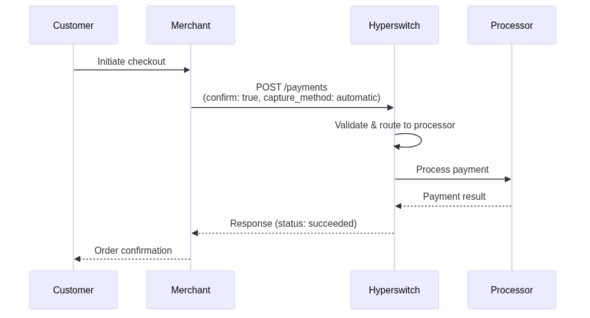
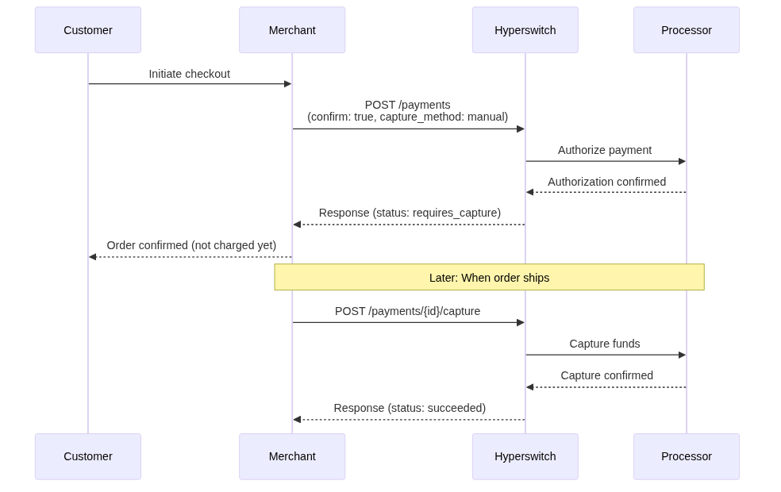
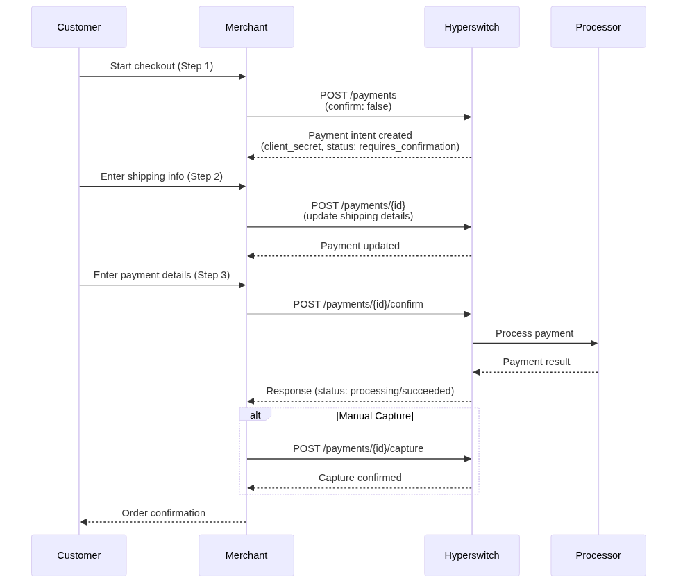
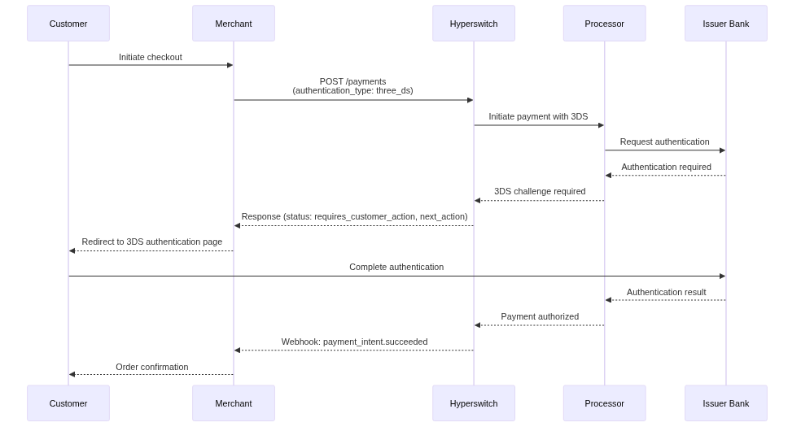
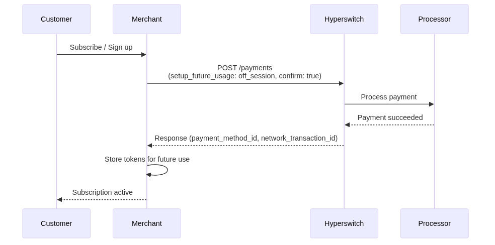
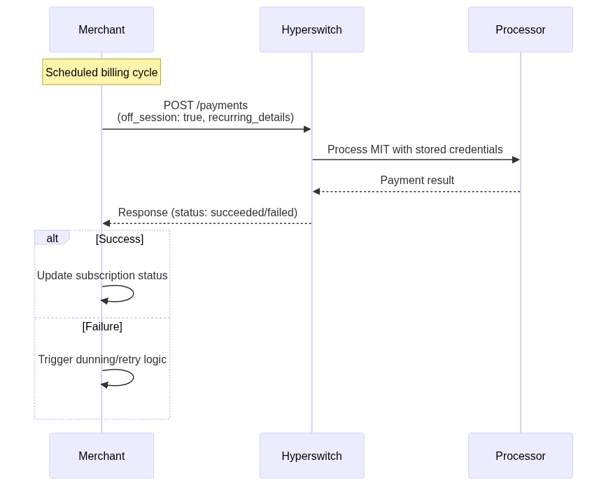

# Payments (Cards)

Process card payments with flexibility and security. Hyperswitch supports multiple payment flows—from simple one-time charges to complex recurring billing—while keeping your PCI compliance scope minimal through secure tokenization.


**Why Hyperswitch for Card Payments?**
- **Reduced PCI Scope**: Card data never touches your servers
- **Multiple Capture Options**: Automatic, manual, partial, and scheduled captures
- **3D Secure Ready**: Built-in support for customer authentication
- **Smart Routing**: Automatic failover between payment processors


## Table of Contents

- [Core Concepts](#core-concepts)
- [Payment Flows](#payment-flows)
  - [Instant Payment (Automatic Capture)](#1-instant-payment-automatic-capture)
  - [Two-Step Manual Capture](#2-two-step-manual-capture)
  - [Fully Decoupled Flow](#3-fully-decoupled-flow)
  - [3D Secure Authentication](#4-3d-secure-authentication-flow)
- [Recurring Payments](#recurring-payments-and-payment-storage)
- [Saved Payment Methods](#using-saved-payment-methods)
- [Status Flow Summary](#status-flow-summary)
- [When to Use Which Flow](#when-to-use-which-flow)
- [Related Documentation](#related-documentation)

---

## Core Concepts

### Terminology

| Term | Description | Example |
|------|-------------|---------|
| `payment_method` | Type of payment instrument | `card`, `wallet`, `bank_transfer` |
| `payment_method_type` | Specific variant | `credit`, `debit` |
| `payment_method_id` | Token representing stored payment method | `pm_abc123xyz` |
| `payment_token` | Short-lived token for confirming payment | `token_xyz789` |
| `client_secret` | Secret key for client-side operations | `pay_xxxxx_secret` |
| `setup_future_usage` | Intent for storing payment method | `on_session`, `off_session` |
| `CIT` | Customer-Initiated Transaction | Customer actively present |
| `MIT` | Merchant-Initiated Transaction | Background/recurring charge |

### Capture Methods

| Method | Description | Use Case |
|--------|-------------|----------|
| `automatic` | Funds captured immediately | Simple e-commerce |
| `manual` | Authorization only, capture later | Ship before charging |
| `manual_multiple` | Multiple partial captures | Installment releases |
| `scheduled` | Auto-capture at future time | Pre-ordered items |

### Payment Status Flow

```
created → requires_confirmation → processing → succeeded
                     ↓
              requires_customer_action (3DS)
                     ↓
              requires_capture (manual capture)
                     ↓
              failed / cancelled / partially_captured
```

**Terminal States** (no further action required):
- `succeeded` - Payment completed successfully
- `failed` - Payment failed, can retry with different method
- `cancelled` - Payment was cancelled
- `partially_captured` - Partial capture completed (manual_multiple)

---

## Payment Flows

Choose the right flow based on your business requirements:

| Flow | Capture | Customer Present | Complexity | Best For |
|------|---------|------------------|------------|----------|
| **Instant** | Automatic | Yes | Low | Standard checkout |
| **Manual** | Manual | Yes | Medium | Delayed shipping |
| **Decoupled** | Either | Yes | High | Progressive checkout |
| **3D Secure** | Either | Yes | Medium | High-risk transactions |

### 1. Instant Payment (Automatic Capture)

**Use Case:** Standard e-commerce checkout where goods are shipped immediately or services delivered instantly.

<figure><figcaption>Instant payment with automatic capture</figcaption></figure>

#### Sequence Diagram



**Key Characteristics:**
- Single API call to create and confirm payment
- Funds captured immediately upon authorization
- Best for digital goods, immediate service delivery
- No additional capture step required

---

### 2. Two-Step Manual Capture

**Use Case:** When you need to authorize funds but capture only after shipping, service completion, or inventory confirmation.

<figure><figcaption>Authorize now, capture later</figcaption></figure>

#### Sequence Diagram



**Key Characteristics:**
- Authorization holds funds on customer's card
- Capture can be full or partial amount
- Multiple partial captures supported with `manual_multiple`
- Authorization typically expires after 7-10 days


Learn more about [Manual Capture](manual-capture/) and [Overcapture](manual-capture/overcapture.md) for capturing amounts greater than the original authorization.


---

### 3. Fully Decoupled Flow

**Use Case:** Complex checkout journeys where payment data is collected progressively, such as headless checkout, B2B portals, or multi-step forms.

<figure><figcaption>Create → Update → Confirm → Capture</figcaption></figure>

#### Sequence Diagram



**Key Characteristics:**
- Payment intent created separately from confirmation
- Allows incremental data collection
- Supports both automatic and manual capture
- Ideal for multi-page checkout flows

---

### 4. 3D Secure Authentication Flow

**Use Case:** Enhanced security for high-risk transactions or regulatory compliance (PSD2 SCA).

<figure><figcaption>3D Secure customer authentication</figcaption></figure>

#### Sequence Diagram



**Key Characteristics:**
- Redirects customer to bank for authentication
- Required for high-risk transactions
- Supports both frictionless and challenge flows
- Mandatory for PSD2 compliance in EU

**Status Progression:**
```
processing → requires_customer_action → succeeded
                    ↓
              (Customer completes 3DS)
                    ↓
              redirect to return_url
```


Learn more about [3DS Decision Manager](../../explore-hyperswitch/workflows/3ds-decision-manager.md) for configuring authentication rules.


---

## Recurring Payments and Payment Storage

Store payment methods for future use with customer consent.

### Saving Payment Methods

When creating a payment, set `setup_future_usage` to indicate intent for storing the payment method:

| Value | Use When | Example |
|-------|----------|---------|
| `on_session` | Customer will be present for future payments | Express checkout for returning customers |
| `off_session` | Charging without customer present | Subscriptions, auto-renewals |

### Customer Consent Capture

For compliance with card network rules, you must capture explicit customer consent before storing payment methods. The `customer_acceptance` object records:

- **Acceptance type**: How consent was obtained (online/offline)
- **Timestamp**: When consent was given
- **Online context**: IP address and user agent (for online consent)


When using Hyperswitch SDK, `customer_acceptance` is automatically sent when the customer checks "Save card for future use".


---

## Using Saved Payment Methods

<figure><figcaption>Retrieve and use stored payment methods</figcaption></figure>

### Retrieving Stored Payment Methods

Use the customer's stored payment methods endpoint to display saved cards. The response includes masked card details (last 4 digits, expiry) without exposing sensitive data.

### Using a Saved Payment Method

Reference the stored payment method using `payment_token` (the `payment_method_id`) in subsequent payment requests. This eliminates the need to collect card details again.

### PCI Compliance and Tokenization

Storing `payment_method_id` (a secure token) instead of raw card data significantly reduces your PCI DSS scope:

| Approach | PCI Scope | Description |
|----------|-----------|-------------|
| Hyperswitch SDK | SAQ A | Minimal compliance - no card data touches your systems |
| Direct API Integration | SAQ D | Full compliance required - card data passes through your servers |
| Token Only (`payment_method_id`) | SAQ A-EP | Reduced scope - only tokens stored |

Always consult with a PCI QSA for your specific compliance requirements.

---

## Recurring Payment Flows

### Customer-Initiated Transaction (CIT) Setup

<figure><figcaption>Customer-initiated transaction with card storage</figcaption></figure>

#### Sequence Diagram



**Use Case:** First-time subscription signup with immediate charge or free trial setup.

### Merchant-Initiated Transaction (MIT) Execution

<figure><figcaption>Merchant-initiated recurring charge</figcaption></figure>

#### Sequence Diagram



**MIT can use either:**
- **Stored Payment Method** (`payment_method_id`): Reference the tokenized card
- **Network Transaction ID**: Use the network transaction ID from a previous CIT


Learn more about [Recurring Payments](recurring-payments.md), including connector-agnostic MIT routing.


---

## When to Use Which Flow

Use this decision matrix to select the appropriate payment flow for your use case:

| Use Case | Recommended Flow | Capture Method | Key Parameters |
|----------|-----------------|----------------|----------------|
| Standard e-commerce checkout | Instant Payment | `automatic` | `confirm: true` |
| Pre-orders / Backorders | Two-Step Manual | `manual` | `confirm: true`, capture later |
| Multi-step checkout wizard | Decoupled Flow | Either | `confirm: false` initially |
| High-value transactions (>€30) | 3D Secure | Either | `authentication_type: three_ds` |
| Subscription signup | CIT Flow | `automatic` | `setup_future_usage: off_session` |
| Recurring billing | MIT Flow | `automatic` | `off_session: true` |
| Pay-per-use services | Manual Capture | `manual` | Charge after usage period |
| Marketplace with holds | Manual Multiple | `manual_multiple` | Partial captures to seller |

### Flow Selection Decision Tree

```
Is this a recurring/subscription payment?
├── YES → Has customer completed initial CIT?
│   ├── YES → Use MIT Flow (off_session: true)
│   └── NO → Use CIT Flow (setup_future_usage: off_session)
└── NO → Is customer present during checkout?
    ├── NO → Error: Card payments require customer presence
    └── YES → Do you need to authorize before capturing?
        ├── YES → Use Two-Step Manual Capture
        └── NO → Is this a multi-step checkout?
            ├── YES → Use Decoupled Flow
            └── NO → Does transaction require 3DS?
                ├── YES → Use 3D Secure Flow
                └── NO → Use Instant Payment
```

---

## Status Flow Summary

<figure><figcaption>Complete payment status lifecycle</figcaption></figure>

### Status Quick Reference

| Status | Action Required | Terminal |
|--------|-----------------|----------|
| `requires_confirmation` | Confirm payment | No |
| `requires_customer_action` | Complete 3DS/redirect | No |
| `requires_capture` | Capture funds | No |
| `processing` | Wait for completion | No |
| `succeeded` | None | Yes |
| `failed` | Retry or alternate method | Yes |
| `cancelled` | None | Yes |
| `partially_captured` | Capture remaining (optional) | Yes |

---

## Related Documentation

### Getting Started
- [Quick Start Guide](../../getting-started/quick-start/) - Set up your first payment in 5 minutes
- [API Keys Setup](../../getting-started/api-keys.md) - Generate and manage API credentials
- [Business Profiles](../../getting-started/business-profiles.md) - Configure payment processors

### Payment Flows
- [Manual Capture](manual-capture/) - Deep dive into manual and partial capture
- [Recurring Payments](recurring-payments.md) - Complete guide to CIT/MIT flows
- [3DS Decision Manager](../../explore-hyperswitch/workflows/3ds-decision-manager.md) - Configure authentication rules

### Integration
- [Hyperswitch SDK](../../getting-started/hyperswitch-sdk.md) - Client-side integration guide
- [Webhooks](../../webhooks/) - Real-time payment status updates
- [Testing in Sandbox](../../getting-started/testing.md) - Test card numbers and scenarios

### Reference
- [API Reference](https://api-reference.hyperswitch.io) - Complete API documentation
- [Error Codes](../../reference/error-codes.md) - Troubleshooting common issues
- [PCI Compliance Guide](../../security/pci-compliance.md) - Compliance requirements

### Support
- [Discord Community](https://discord.gg/hyperswitch) - Get help from the community
- [Support Email](mailto:support@hyperswitch.io) - Contact our support team
