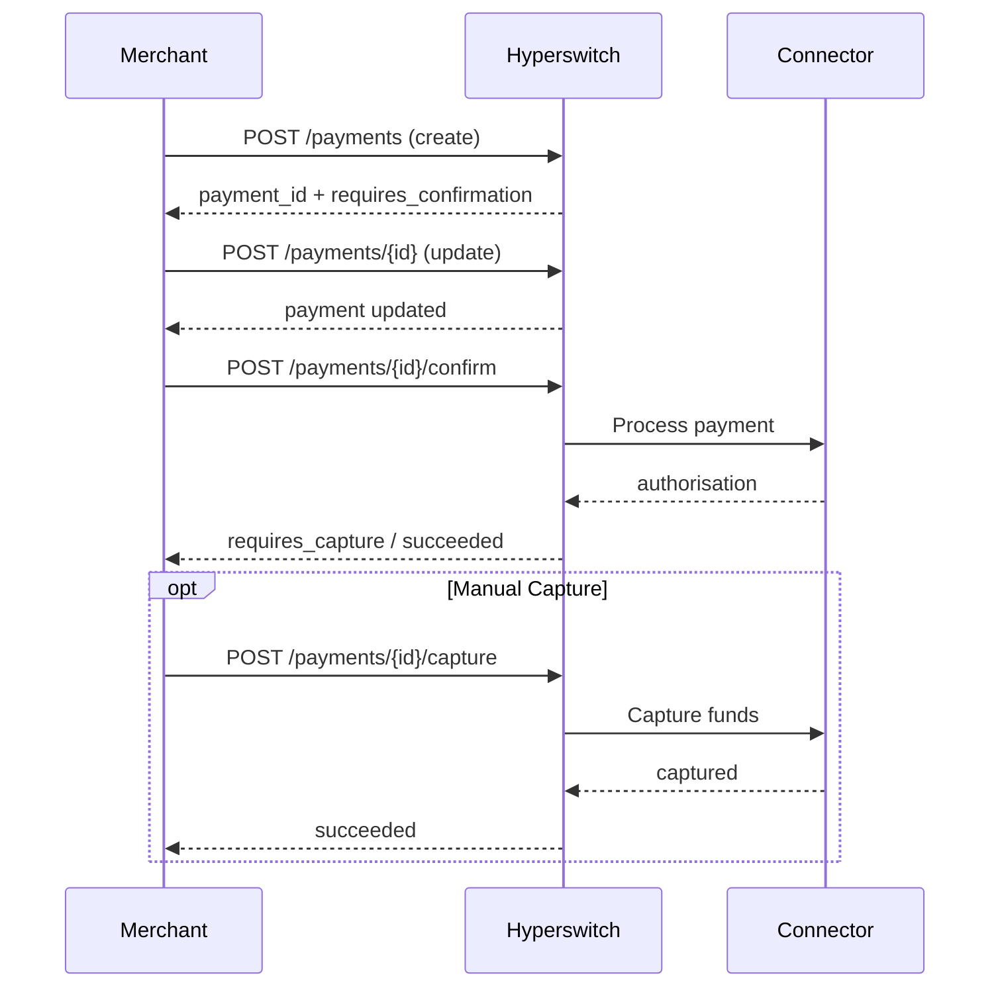
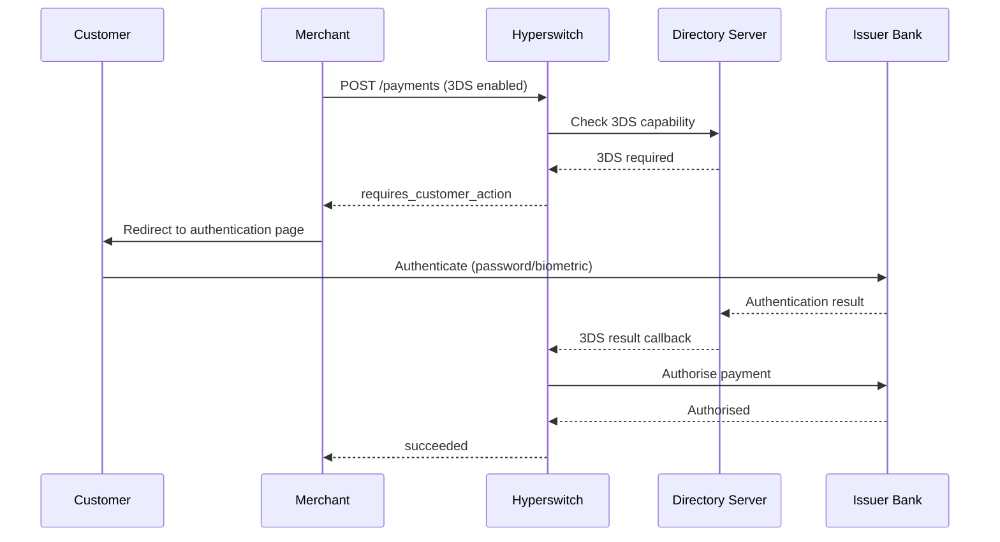
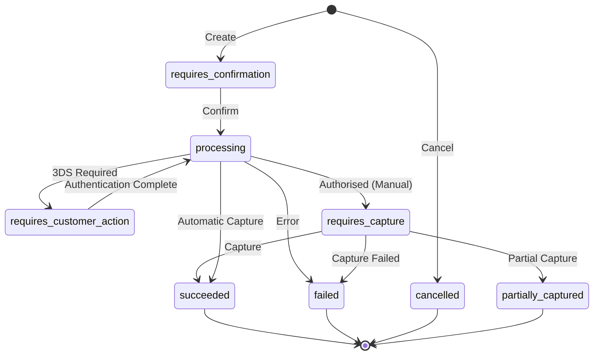

# Payments (cards)

Hyperswitch provides flexible payment processing with multiple flow patterns to accommodate different business needs. The system supports one-time payments, saved payment methods, and recurring billing through a comprehensive API design.

## Integration Paths

### Client-Side SDK Payments (Tokenise Post Payment)

Refer to the [Payments (Cards) section](https://docs.hyperswitch.io/about-hyperswitch/payment-suite-1/payments) if your flow requires the SDK to initiate payments directly. In this model, the SDK handles the payment trigger and communicates downstream to the Hyperswitch server and your chosen Payment Service Providers (PSPs). This path supports dynamic, frontend-driven payment experiences.

## One-Time Payment Patterns

### 1. Instant Payment (Automatic Capture)

**Use Case:** Simple, immediate payment processing

**Endpoint:**

```http
POST /payments
```

**Required Fields:**

| Field | Type | Value | Description |
|-------|------|-------|-------------|
| `confirm` | boolean | `true` | Automatically confirms the payment |
| `capture_method` | string | `"automatic"` | Captures funds immediately |
| `payment_method` | string | - | The payment method type |

**Final Status:** `succeeded`

### 2. Two-Step Manual Capture

**Use Case:** Deferred capture (e.g., ship before charging)

**Flow:**

1. **Authorise:** `POST /payments` with `capture_method: "manual"`
2. **Status:** `requires_capture`
3. **Capture:** `POST /payments/{payment_id}/capture`
4. **Final Status:** `succeeded`

**Example Authorise Request:**

```json
{
  "amount": 1000,
  "currency": "USD",
  "capture_method": "manual",
  "payment_method": "card",
  "payment_method_data": {
    "card": {
      "card_number": "4242424242424242",
      "card_exp_month": "12",
      "card_exp_year": "30",
      "card_cvc": "123"
    }
  }
}
```

Read more about [manual capture workflows](https://docs.hyperswitch.io/about-hyperswitch/payment-suite-1/payments-cards/manual-capture).

### 3. Fully Decoupled Flow

**Use Case:** Complex checkout journeys with multiple modification steps. This suits headless checkout or B2B portals where data is filled progressively.

**Endpoints:**

| Step | Endpoint | Purpose |
|------|----------|---------|
| Create | `POST /payments` | Initialise a new payment |
| Update | `POST /payments/{payment_id}` | Modify payment details |
| Confirm | `POST /payments/{payment_id}/confirm` | Confirm the payment intent |
| Capture | `POST /payments/{payment_id}/capture` | Capture funds (if manual) |

**Decoupled Flow:**



### 4. 3D Secure Authentication Flow

**Use Case:** Enhanced security with customer authentication

**Additional Fields:**

```json
{
  "authentication_type": "three_ds"
}
```

**3DS Flow:**



**Status Progression:** `processing` → `requires_customer_action` → `succeeded`

Read more about the [3DS decision manager workflow](https://docs.hyperswitch.io/explore-hyperswitch/workflows/3ds-decision-manager).

## Recurring Payments and Payment Storage

### 1. Saving Payment Methods

**During Payment Creation:**

Add `setup_future_usage` and include `customer_id`:

```json
{
  "customer_id": "cust_12345",
  "setup_future_usage": "off_session",
  "payment_method": "card",
  "payment_method_data": {
    "card": {
      "card_number": "4242424242424242",
      "card_exp_month": "12",
      "card_exp_year": "30",
      "card_cvc": "123"
    }
  }
}
```

**Result:** The response includes a `payment_method_id` for future use.

**Understanding `setup_future_usage`:**

| Value | Use When | Example Scenarios |
|-------|----------|-------------------|
| `on_session` | The customer is actively present during the transaction. Typical for saving card details for faster checkouts in subsequent sessions. | Card vaulting for e-commerce sites |
| `off_session` | You intend to charge the customer later without their active involvement. Suitable for subscriptions and recurring billing. | Subscriptions, merchant-initiated transactions (MITs) |

### 2. Using Saved Payment Methods

**Steps:**

1. **Initiate:** Create payment with `customer_id`
2. **List:** Retrieve saved cards via `GET /customers/{customer_id}/payment_methods`
3. **Confirm:** Use the selected `payment_token` in the confirm call

**List Payment Methods Response:**

```json
{
  "customer_payment_methods": [
    {
      "payment_method_id": "pm_123456",
      "payment_method": "card",
      "card": {
        "scheme": "Visa",
        "last4_digits": "4242",
        "expiry_month": "12",
        "expiry_year": "30"
      }
    }
  ]
}
```

### PCI Compliance and `payment_method_id`

Storing `payment_method_id` (a token representing the actual payment instrument) significantly reduces your PCI DSS scope. Hyperswitch securely stores the sensitive card details and provides you with this token. While you still need to ensure your systems handle `payment_method_id` and related customer data securely, you avoid the complexities of storing raw card numbers. Always consult with a PCI QSA to understand your specific compliance obligations.

## Recurring Payment Flows

### 3. Customer-Initiated Transaction (CIT) Setup

**Use Case:** Customer is present to authenticate and save payment credentials for future use.

**Key Fields:**

```json
{
  "customer_id": "cust_12345",
  "setup_future_usage": "off_session",
  "payment_method": "card",
  "authentication_type": "three_ds"
}
```

Read more about [recurring payments setup](https://docs.hyperswitch.io/about-hyperswitch/payment-suite-1/payments-cards/recurring-payments).

### 4. Merchant-Initiated Transaction (MIT) Execution

**Use Case:** Charge a saved payment method without the customer present.

**Key Fields:**

```json
{
  "customer_id": "cust_12345",
  "payment_method": "card",
  "payment_method_data": {
    "card": {
      "card_token": "pm_123456"
    }
  },
  "off_session": true,
  "recurring_details": {
    "type": "merchant_initiated"
  }
}
```

Read more about [merchant-initiated transactions](https://docs.hyperswitch.io/about-hyperswitch/payment-suite-1/payments-cards/recurring-payments).

## Status Flow Summary

**Payment Status Lifecycle:**



## Notes

* **Terminal States:** `succeeded`, `failed`, `cancelled`, and `partially_captured` are terminal states requiring no further action.

* **Capture Methods:** The system supports the following capture methods:

| Method | Description |
|--------|-------------|
| `automatic` | Funds are captured immediately upon authorisation |
| `manual` | Funds are captured in a separate step |
| `manual_multiple` | Funds are captured in multiple partial amounts via separate steps |
| `scheduled` | Funds are captured automatically at a future predefined time |

* **Authentication:** 3DS authentication automatically resumes payment processing after the customer completes authentication.

* **MIT Compliance:** Off-session recurring payments follow industry standards for merchant-initiated transactions.
