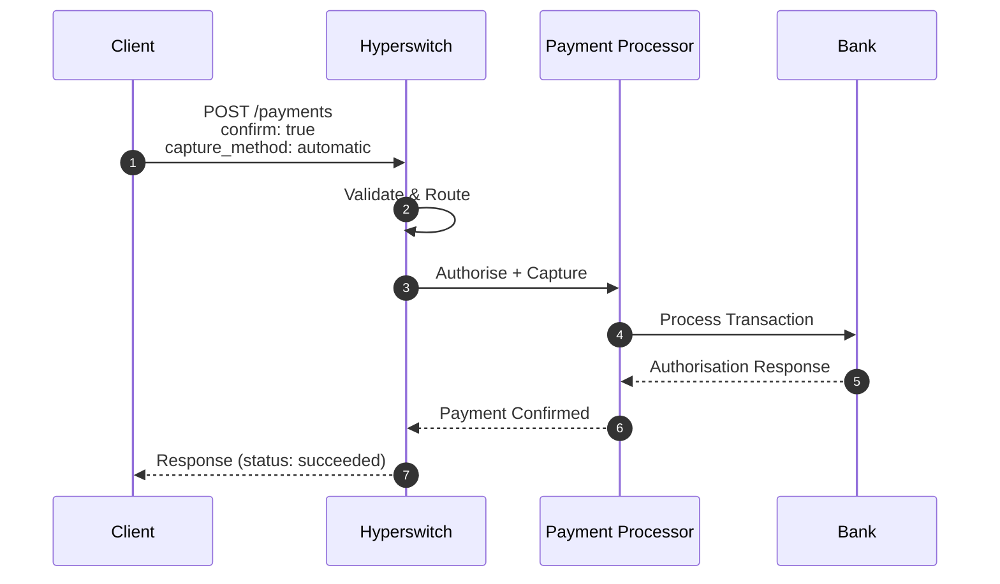
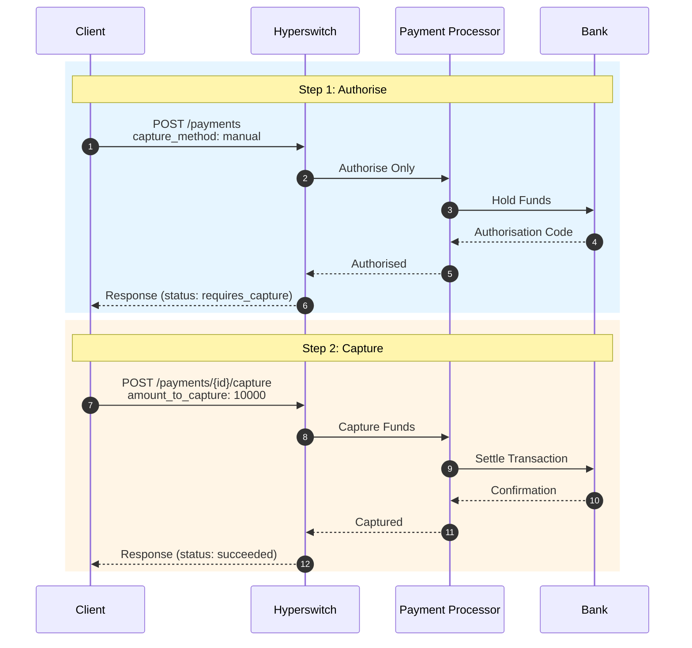
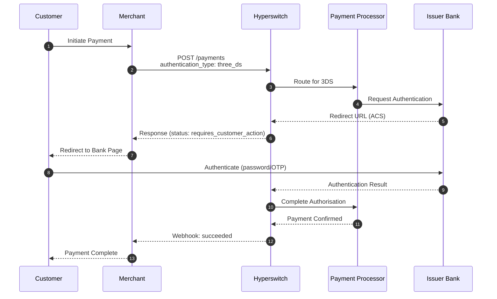
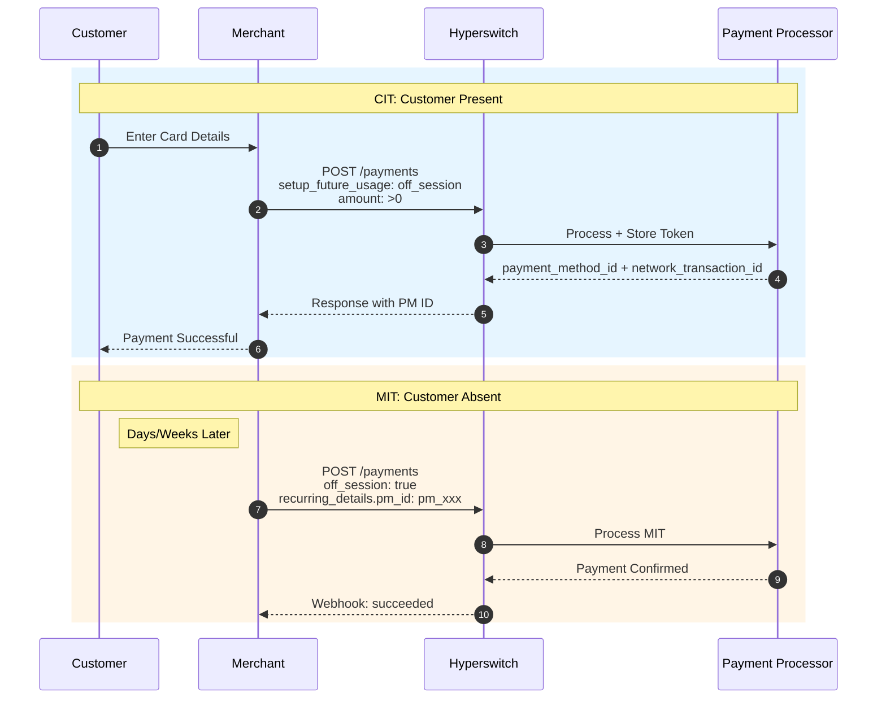
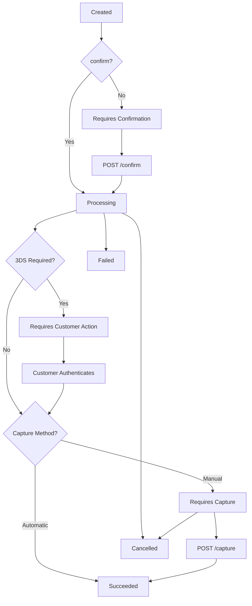

# Payments (cards)

## TL;DR

Hyperswitch card payments support 4 flow patterns: instant capture, manual capture, decoupled flows, and 3D Secure. Use `confirm: true` for instant payments, `capture_method: manual` for deferred capture, and `setup_future_usage: off_session` for recurring billing. All flows return standardised status codes and support webhook notifications.

---

## 5-Minute Quick Start

### Prerequisites

Before you begin, ensure you have:

1. **Hyperswitch Account**: Sign up at [app.hyperswitch.io](https://app.hyperswitch.io)
2. **API Key**: Generate from Developer → API Keys in the dashboard
3. **Connected Connector**: Configure at least one payment processor (e.g., Stripe, Adyen)
4. **cURL**: Installed on your system for testing

### Your First Payment

Run this cURL command to process your first card payment:

```bash
curl --location 'https://sandbox.hyperswitch.io/payments' \
--header 'Content-Type: application/json' \
--header 'Accept: application/json' \
--header 'api-key: YOUR_API_KEY' \
--data '{
    "amount": 6540,
    "currency": "USD",
    "confirm": true,
    "capture_method": "automatic",
    "customer_id": "customer_123",
    "email": "customer@example.com",
    "payment_method": "card",
    "payment_method_type": "credit",
    "payment_method_data": {
        "card": {
            "card_number": "4242424242424242",
            "card_exp_month": "12",
            "card_exp_year": "2030",
            "card_holder_name": "John Doe",
            "card_cvc": "123"
        }
    }
}'
```

**Expected Response:**

```json
{
    "payment_id": "pay_xxxxxxxxxxxxxxxx",
    "status": "succeeded",
    "amount": 6540,
    "currency": "USD",
    "connector": "stripe",
    "client_secret": "pay_xxxxxxxxxxxxxxxx_secret_yyyyyyyyyyyyy"
}
```

---

## Authentication

All API requests require authentication using an API key passed in the header:

```
api-key: YOUR_API_KEY
```

### API Key Types

| Key Type | Use Case | Prefix |
|----------|----------|--------|
| **Secret Key** | Server-to-server API calls | `snd_` |
| **Publishable Key** | Client-side SDK initialisation | `pk_` |

### Example Authentication

```bash
# Secret key for backend calls
curl --header 'api-key: snd_live_xxxxxxxxxxxxxxxx' \
  'https://api.hyperswitch.io/payments/pay_123'

# Publishable key for frontend SDK
const hyperPromise = loadHyper("pk_live_xxxxxxxxxxxxxxxx");
```

---

## What are the one-time payment patterns?

### Q: How do I process an instant payment with automatic capture?

**A:** Use this pattern for simple, immediate payment processing where funds are captured immediately.

#### Instant Payment Sequence



**Endpoint:** `POST /payments`

**Required Fields:**

| Field | Type | Value | Description |
|-------|------|-------|-------------|
| `confirm` | boolean | `true` | Auto-confirm the payment |
| `capture_method` | string | `"automatic"` | Capture immediately |
| `payment_method` | string | `"card"` | Payment method type |
| `amount` | integer | >0 | Amount in smallest currency unit |
| `currency` | string | ISO 4217 | Currency code (e.g., "USD") |

**Final Status:** `succeeded`

**Example Request:**

```json
{
    "amount": 10000,
    "currency": "USD",
    "confirm": true,
    "capture_method": "automatic",
    "customer_id": "cust_123",
    "payment_method": "card",
    "payment_method_data": {
        "card": {
            "card_number": "4242424242424242",
            "card_exp_month": "12",
            "card_exp_year": "2030",
            "card_holder_name": "John Doe",
            "card_cvc": "123"
        }
    }
}
```

---

### Q: How do I implement manual capture (authorise now, charge later)?

**A:** Use manual capture when you need to verify funds availability but only charge when goods ship or services are rendered.

#### Manual Capture Sequence



**Flow:**

1. **Authorise:** `POST /payments` with `capture_method: "manual"`
2. **Status:** `requires_capture` (funds held for up to 7 days)
3. **Capture:** `POST /payments/{payment_id}/capture`
4. **Final Status:** `succeeded`

**Capture Request:**

```bash
curl --location 'https://sandbox.hyperswitch.io/payments/pay_123/capture' \
--header 'Content-Type: application/json' \
--header 'api-key: YOUR_API_KEY' \
--data '{
    "amount_to_capture": 10000
}'
```

**Capture Methods Comparison:**

| Method | Description | Use Case |
|--------|-------------|----------|
| `automatic` | Capture immediately on authorisation | Standard e-commerce |
| `manual` | Authorise now, capture once via API | Pre-orders, shipping later |
| `manual_multiple` | Multiple partial captures | Multi-shipment orders |
| `scheduled` | Auto-capture at future date | Delayed billing |

**Field Specifications for Capture:**

| Field | Type | Required | Description |
|-------|------|----------|-------------|
| `amount_to_capture` | integer | Yes | Amount to capture in smallest currency unit |
| `statement_descriptor` | string | No | Descriptor on customer statement |
| `metadata` | object | No | Key-value pairs for your reference |

Read more - [Manual Capture Documentation](./manual-capture/)

---

### Q: How do I implement a fully decoupled payment flow?

**A:** Use the decoupled flow for complex checkout journeys where you need multiple modification steps before final confirmation.

**Use Case:** Headless checkout, B2B portals, progressive data entry

**Endpoints:**

| Step | Endpoint | Purpose |
|------|----------|---------|
| 1. Create | `POST /payments` | Initialise payment intent |
| 2. Update | `POST /payments/{id}` | Modify payment details |
| 3. Confirm | `POST /payments/{id}/confirm` | Confirm with payment method |
| 4. Capture | `POST /payments/{id}/capture` | Capture funds (if manual) |

**Example Flow:**

```javascript
// Step 1: Create payment intent
const createResponse = await fetch('/payments', {
    method: 'POST',
    headers: { 'api-key': API_KEY },
    body: JSON.stringify({
        amount: 50000,
        currency: 'USD',
        confirm: false
    })
});
const { payment_id } = await createResponse.json();

// Step 2: Update with customer details
await fetch(`/payments/${payment_id}`, {
    method: 'POST',
    headers: { 'api-key': API_KEY },
    body: JSON.stringify({
        customer_id: 'cust_456',
        description: 'Enterprise license'
    })
});

// Step 3: Confirm with card
await fetch(`/payments/${payment_id}/confirm`, {
    method: 'POST',
    headers: { 'api-key': API_KEY },
    body: JSON.stringify({
        payment_method: 'card',
        payment_method_data: { card: { /* card details */ } }
    })
});
```

---

### Q: How do I handle 3D Secure authentication?

**A:** 3D Secure adds an extra layer of security by requiring customer authentication with their bank.

#### 3D Secure Sequence



**Required Fields:**

```json
{
    "authentication_type": "three_ds",
    "return_url": "https://your-site.com/payment/complete"
}
```

**Status Progression:** `processing` → `requires_customer_action` → `succeeded`

Read more - [3DS Decision Manager](../../../explore-hyperswitch/workflows/3ds-decision-manager)

---

## What are the recurring payment flows?

### Q: How do I save a payment method for future use?

**A:** Pass `setup_future_usage` when creating a payment to store the payment method.

**During Payment Creation:**

* Add `setup_future_usage: "off_session"` or `"on_session"`
* Include `customer_id`
* **Result:** `payment_method_id` returned on success

**Understanding `setup_future_usage`:**

| Value | Use Case | Example |
|-------|----------|---------|
| `on_session` | Customer present during transaction | Saved cards for faster checkout |
| `off_session` | Customer not present | Subscriptions, recurring billing, MIT |

**Example Request:**

```json
{
    "amount": 2999,
    "currency": "USD",
    "confirm": true,
    "customer_id": "cust_123",
    "setup_future_usage": "off_session",
    "customer_acceptance": {
        "acceptance_type": "online",
        "accepted_at": "2024-01-15T10:30:00Z",
        "online": {
            "ip_address": "192.168.1.1",
            "user_agent": "Mozilla/5.0..."
        }
    }
}
```

---

### Q: How do I use saved payment methods?

**A:** Retrieve saved methods for a customer and use the `payment_token` for subsequent payments.

**Steps:**

1. **Initiate:** Create payment with `customer_id`
2. **List:** Get saved cards via `GET /customers/{customer_id}/payment_methods`
3. **Confirm:** Use selected `payment_method_id` in confirm call

**List Saved Payment Methods:**

```bash
curl --location 'https://sandbox.hyperswitch.io/customers/cust_123/payment_methods' \
--header 'api-key: YOUR_API_KEY'
```

**Response:**

```json
{
    "customer_payment_methods": [
        {
            "payment_method_id": "pm_abc123",
            "payment_method": "card",
            "payment_method_type": "credit",
            "card": {
                "scheme": "Visa",
                "last4_digits": "4242",
                "expiry_month": "12",
                "expiry_year": "2030"
            }
        }
    ]
}
```

---

### Q: What is PCI compliance for payment_method_id?

**A:** Storing `payment_method_id` significantly reduces your PCI DSS scope. Hyperswitch securely stores sensitive card details and provides a token for your use.

**Benefits:**

* Avoid storing raw card numbers
* Simplified PCI compliance
* Secure tokenised storage

**Note:** Always consult with a PCI QSA to understand your specific compliance obligations.

---

### Q: How do I set up Customer-Initiated Transactions (CIT)?

**A:** CITs occur when the customer is present and actively approves the payment.

#### CIT + MIT Setup Sequence



Read more - [Recurring Payments](./recurring-payments.md)

---

### Q: How do I process Merchant-Initiated Transactions (MIT)?

**A:** MITs are processed without the customer present using stored credentials.

**Required Fields:**

```json
{
    "amount": 2999,
    "currency": "USD",
    "confirm": true,
    "off_session": true,
    "recurring_details": {
        "type": "payment_method_id",
        "data": "pm_abc123"
    }
}
```

**MIT Options:**

| Type | Description |
|------|-------------|
| `payment_method_id` | Hyperswitch stored payment method |
| `processor_payment_token` | PSP-issued token |
| `network_transaction_id` | Card network transaction ID |
| `network_token` | Network token + NTID |
| `limited_card_data` | Reduced card data set |

Read more - [Recurring Payments](./recurring-payments.md)

---

## SDK Code Examples

### React Integration

```jsx
import { loadHyper } from "@juspay-tech/hyper-js";
import { HyperElements } from "@juspay-tech/react-hyper-js";

// Load Hyper
const hyperPromise = loadHyper("pk_live_YOUR_KEY", {
    customBackendUrl: "https://api.hyperswitch.io"
});

// Create Payment
useEffect(() => {
    fetch("/create-payment", {
        method: "POST",
        headers: { "Content-Type": "application/json" },
        body: JSON.stringify({ amount: 5000, currency: "USD" })
    })
    .then(res => res.json())
    .then(data => setClientSecret(data.client_secret));
}, []);

// Render Checkout
<HyperElements options={{ clientSecret }} hyper={hyperPromise}>
    <CheckoutForm />
</HyperElements>
```

### Node.js Backend

```javascript
const createPayment = async (amount, currency) => {
    const response = await fetch('https://sandbox.hyperswitch.io/payments', {
        method: 'POST',
        headers: {
            'Content-Type': 'application/json',
            'api-key': process.env.HYPERSWITCH_API_KEY
        },
        body: JSON.stringify({
            amount: amount * 100, // Convert to cents
            currency,
            confirm: false
        })
    });
    return await response.json();
};
```

### Python Integration

```python
import requests

def create_payment(amount: int, currency: str, api_key: str):
    headers = {
        'Content-Type': 'application/json',
        'api-key': api_key
    }
    payload = {
        'amount': amount,
        'currency': currency,
        'confirm': True,
        'capture_method': 'automatic',
        'payment_method': 'card',
        'customer_id': 'cust_123'
    }
    response = requests.post(
        'https://sandbox.hyperswitch.io/payments',
        json=payload,
        headers=headers
    )
    return response.json()
```

---

## Webhook Documentation

### Event Types

| Event | Description |
|-------|-------------|
| `payment_intent.succeeded` | Payment completed successfully |
| `payment_intent.failed` | Payment failed |
| `payment_intent.requires_capture` | Authorised, awaiting capture |
| `payment_intent.captured` | Manual capture completed |
| `payment_intent.cancelled` | Payment cancelled |

### Webhook Payload Example

```json
{
    "event_type": "payment_intent.succeeded",
    "event_id": "evt_xxxxxxxx",
    "created": "2024-01-15T10:30:00Z",
    "data": {
        "payment_id": "pay_xxxxxxxx",
        "status": "succeeded",
        "amount": 10000,
        "currency": "USD",
        "connector": "stripe",
        "customer_id": "cust_123"
    }
}
```

### Webhook Verification

```javascript
const crypto = require('crypto');

function verifyWebhook(payload, signature, secret) {
    const expected = crypto
        .createHmac('sha256', secret)
        .update(payload)
        .digest('hex');
    return crypto.timingSafeEqual(
        Buffer.from(signature),
        Buffer.from(expected)
    );
}
```

---

## Error Handling Guide

### Common Error Codes

| Code | HTTP Status | Description | Resolution |
|------|-------------|-------------|------------|
| `HE_00` | 400 | Invalid request | Check request payload |
| `HE_01` | 401 | Authentication failed | Verify API key |
| `HE_02` | 404 | Resource not found | Check payment ID |
| `HE_03` | 422 | Validation error | Review field requirements |
| `HE_04` | 429 | Rate limit exceeded | Implement exponential backoff |
| `HE_05` | 500 | Internal server error | Retry with backoff |
| `HE_06` | 502 | Connector error | Check connector status |
| `HE_07` | 504 | Gateway timeout | Retry the request |

### Retry Logic

```javascript
async function retryWithBackoff(fn, maxRetries = 3) {
    for (let i = 0; i < maxRetries; i++) {
        try {
            return await fn();
        } catch (error) {
            if (error.code === 'HE_04' || error.code === 'HE_05') {
                const delay = Math.pow(2, i) * 1000; // Exponential backoff
                await new Promise(r => setTimeout(r, delay));
                continue;
            }
            throw error;
        }
    }
    throw new Error('Max retries exceeded');
}
```

---

## Test Card Reference

### Successful Payments

| Card Number | Brand | CVC | Expiry |
|-------------|-------|-----|--------|
| `4242424242424242` | Visa | Any 3 digits | Any future date |
| `5555555555554444` | Mastercard | Any 3 digits | Any future date |
| `378282246310005` | American Express | Any 4 digits | Any future date |
| `6011111111111117` | Discover | Any 3 digits | Any future date |

### 3D Secure Testing

| Card Number | Scenario |
|-------------|----------|
| `4000000000003220` | 3DS2 frictionless flow |
| `4000000000003063` | 3DS2 challenge flow |
| `4000000000003055` | 3DS1 challenge flow |

### Declined Payments

| Card Number | Decline Reason |
|-------------|----------------|
| `4000000000000002` | Generic decline |
| `4000000000009995` | Insufficient funds |
| `4000000000009987` | Lost card |
| `4000000000009979` | Stolen card |
| `4000000000009961` | Expired card |

### International Cards

| Card Number | Country | Currency |
|-------------|---------|----------|
| `4000002760000016` | Australia (AU) | AUD |
| `4000001240000000` | Canada (CA) | CAD |
| `4000008260000000` | United Kingdom (GB) | GBP |
| `4000000560000000` | Germany (DE) | EUR |

---

## Status Flow Summary



### Terminal States

| Status | Description | Action Required |
|--------|-------------|-----------------|
| `succeeded` | Payment completed | None |
| `failed` | Payment failed | Retry or notify customer |
| `cancelled` | Payment cancelled | None |
| `partially_captured` | Partial capture completed | None |

---

## FAQ

### Q: What is the maximum authorisation hold period?

**A:** Authorisation holds typically expire after 7 days, though this varies by card issuer. Capture funds within this window to avoid automatic release.

### Q: Can I partially capture a payment?

**A:** Yes, use `manual_multiple` capture method to capture partial amounts across multiple requests.

### Q: How do I handle expired cards for recurring payments?

**A:** Hyperswitch automatically updates card details via network account updater services when available. Failed MITs trigger webhook notifications for manual intervention.

### Q: What currencies are supported?

**A:** Hyperswitch supports 135+ currencies. Check your connector's documentation for specific currency support.

### Q: How do I implement idempotency?

**A:** Include an `Idempotency-Key` header with a unique UUID for each request. Retried requests with the same key return the original response.

```bash
curl --header 'Idempotency-Key: 550e8400-e29b-41d4-a716-446655440000' \
  'https://sandbox.hyperswitch.io/payments'
```

### Q: What is the difference between `payment_method_id` and `payment_token`?

**A:** `payment_method_id` is Hyperswitch's internal identifier for stored payment methods. `payment_token` is a temporary token used during the checkout flow. Use `payment_method_id` for MITs.

### Q: How do I test webhook endpoints?

**A:** Use the Hyperswitch dashboard to send test webhook events. Navigate to Developers → Webhooks → Send Test Event.

---

## Field Type Specifications

### Payment Request Fields

| Field | Type | Required | Constraints |
|-------|------|----------|-------------|
| `amount` | integer | Yes | > 0 |
| `currency` | string | Yes | ISO 4217 (3 chars) |
| `confirm` | boolean | No | Default: false |
| `capture_method` | enum | No | `automatic`, `manual`, `manual_multiple`, `scheduled` |
| `customer_id` | string | No | Max 64 chars |
| `setup_future_usage` | enum | No | `on_session`, `off_session` |
| `authentication_type` | enum | No | `no_three_ds`, `three_ds` |
| `return_url` | string | Conditional | Required for 3DS |
| `description` | string | No | Max 255 chars |
| `metadata` | object | No | Max 50 keys |

### Card Object Fields

| Field | Type | Required | Pattern |
|-------|------|----------|---------|
| `card_number` | string | Yes | 13-19 digits |
| `card_exp_month` | string | Yes | 2 digits (01-12) |
| `card_exp_year` | string | Yes | 4 digits (YYYY) |
| `card_cvc` | string | Yes | 3-4 digits |
| `card_holder_name` | string | No | Max 255 chars |

---

## Additional Notes

* **Capture Methods:** System supports `automatic` (funds captured immediately), `manual` (funds captured in a separate step), `manual_multiple` (funds captured in multiple partial amounts via separate steps), and `scheduled` (funds captured automatically at a future predefined time) capture methods.
* **Authentication:** 3DS authentication automatically resumes payment processing after customer completion
* **MIT Compliance:** Off-session recurring payments follow industry standards for merchant-initiated transactions
