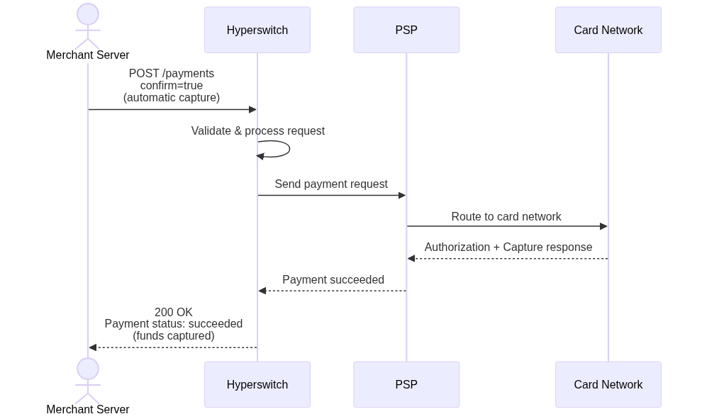
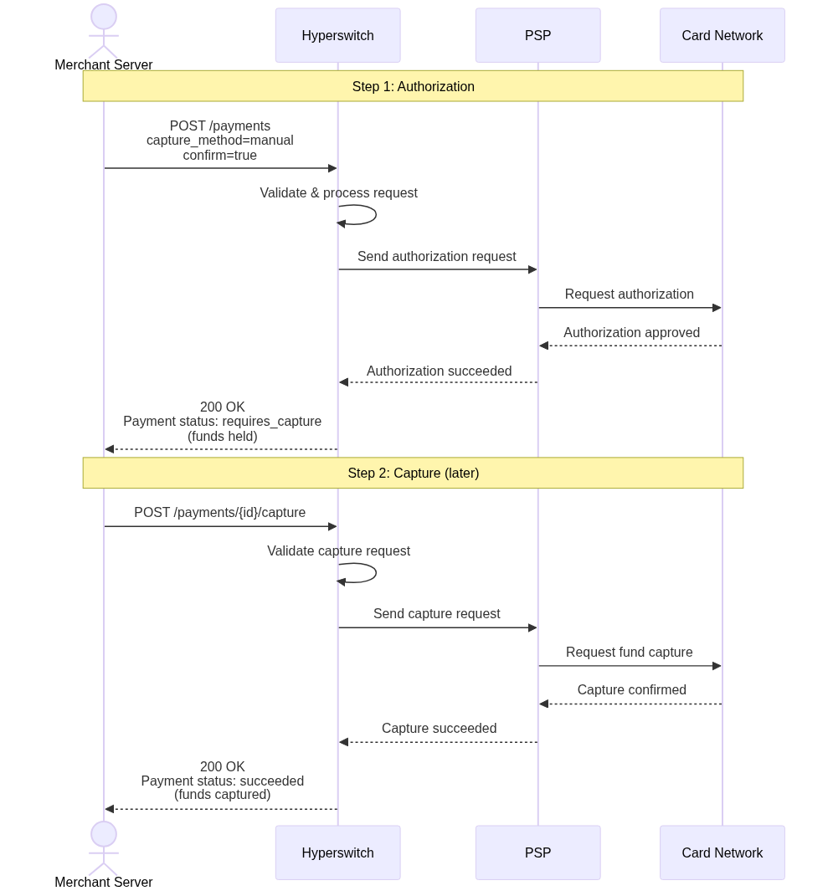
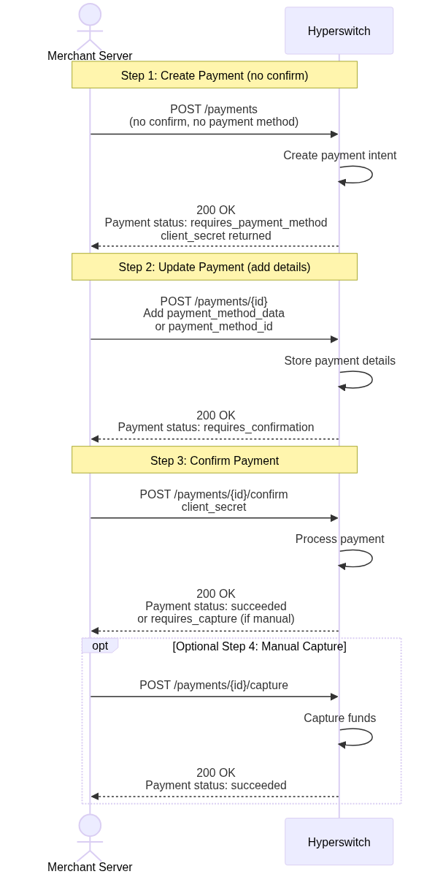
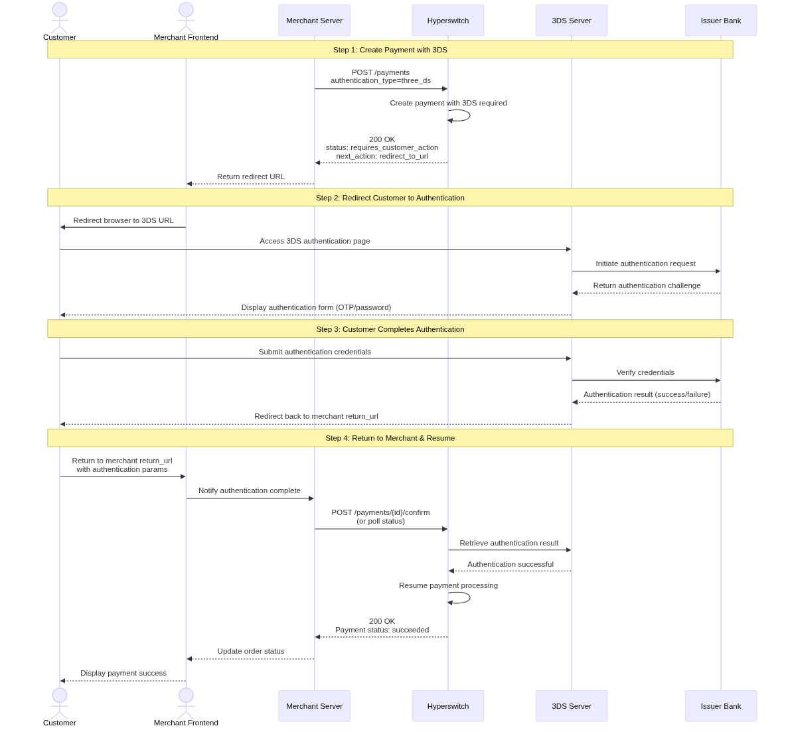
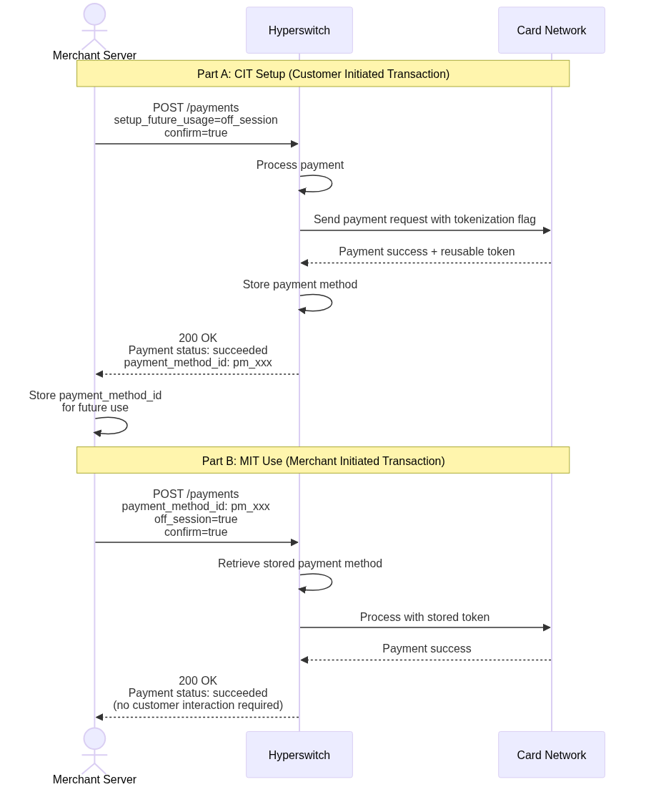

# Payments (cards)

Hyperswitch Payments API enables you to process payments with flexibility and control. Whether you need instant one-time charges, deferred captures for fulfillment workflows, or subscription billing, the API adapts to your business requirements.

**What you'll learn:**
- How to process immediate payments with automatic capture
- How to authorize now and capture later (manual capture)
- How to implement complex checkout flows with multiple steps
- How to handle 3D Secure authentication
- How to securely store payment methods for future use
- How to implement recurring billing and subscriptions

**Why use the Payments API?**
- **Unified interface**: Single API for multiple payment processors
- **PCI scope reduction**: Secure tokenization reduces compliance burden
- **Flexible flows**: Support any checkout experience
- **Global coverage**: Process payments in 100+ currencies


### Choose Your Integration Path

**Option 1: Client-Side SDK (Recommended for Most)**
Use [Unified Checkout](https://hyperswitch.io/docs/sdkIntegrations/unifiedCheckoutWeb) if you don't hold PCI certification. The SDK handles payment data collection securely without card data touching your servers.

**Option 2: Server-Side API (This Guide)**
Use this API guide if you:
- Are PCI certified and handle card data directly
- Need complete control over the payment experience
- Are implementing headless or backend-only integrations


<figure><figcaption>Overview of payment flow integration between your application, Hyperswitch, and payment processors</figcaption></figure>

## Prerequisites

### API Keys and Environment Setup

Before processing payments, you need to configure your Hyperswitch environment:

1. **Sign up** at [Hyperswitch Dashboard](https://app.hyperswitch.io) to create a merchant account
2. **Generate API keys** from the Developers section:
   - **Secret Key (API Key)**: For server-side API authentication
   - **Publishable Key**: For client-side SDK authentication

3. **Configure your environment**:
   | Environment | Use Case |
   |-------------|----------|
   | Sandbox | Development and testing |
   | Production | Live transactions |

> **Security Note**: Never expose your Secret Key in client-side code or public repositories. Store it securely in environment variables on your server.

### Base URLs

Use the following base URLs when making API requests:

| Environment | Base URL |
|-------------|----------|
| Sandbox | `https://sandbox.hyperswitch.io` |
| Production | `https://api.hyperswitch.io` |

### Creating a Customer

For most payment flows (especially saved payment methods and recurring billing), you must first create a customer:

**Endpoint:** `POST /customers`

```bash
curl --request POST \
  --url https://sandbox.hyperswitch.io/customers \
  --header 'Content-Type: application/json' \
  --header 'api-key: your_api_key' \
  --data '{
    "customer_id": "cus_y3oqhf46pyzuxjbcn2giaqnb44",
    "name": "John Doe",
    "email": "john.doe@example.com",
    "phone": "9123456789",
    "phone_country_code": "+91"
  }'
```

**Response:**

```json
{
  "customer_id": "cus_y3oqhf46pyzuxjbcn2giaqnb44",
  "name": "John Doe",
  "email": "john.doe@example.com",
  "phone": "9123456789",
  "phone_country_code": "+91",
  "created_at": "2024-01-15T10:30:00Z"
}
```

## Authentication

### Header Requirements

All API requests must include the following headers:

| Header | Value | Required For |
|--------|-------|--------------|
| `Content-Type` | `application/json` | All requests |
| `api-key` | Your secret key | Server-side API calls |

**Example Headers:**

```bash
--header 'Content-Type: application/json' \
--header 'api-key: snd_c69xxxxxxxxxxxxx'
```

### Key Types and Usage

| Key Type | Format | Where to Use | Security Level |
|----------|--------|--------------|----------------|
| Secret Key (API Key) | `snd_c69***` or `snd_***` | Server-side API calls only | **Highly sensitive** - Never expose publicly |
| Publishable Key | `pk_snd_3b3***` | Client-side SDK initialization | Safe for public exposure |

**Key Rules:**
- Use Secret Key for all backend API operations
- Use Publishable Key only for client-side SDK initialization
- Rotate keys periodically from the Dashboard
- Never commit keys to version control

## Quick Start

Here's a minimal working example to process your first payment:

**Step 1: Create a payment**

```bash
curl --request POST \
  --url https://sandbox.hyperswitch.io/payments \
  --header 'Content-Type: application/json' \
  --header 'api-key: your_api_key' \
  --data '{
    "amount": 6540,
    "currency": "USD",
    "confirm": true,
    "payment_method": "card",
    "payment_method_data": {
      "card": {
        "card_number": "4242424242424242",
        "card_exp_month": "12",
        "card_exp_year": "27",
        "card_cvc": "123",
        "card_holder_name": "John Doe"
      }
    }
  }'
```

**Response:**

```json
{
  "payment_id": "pay_syxxxxxxxxxxxx",
  "status": "succeeded",
  "amount": 6540,
  "currency": "USD",
  "client_secret": "pay_syxxxxxxxxxxxx_secret_szzzzzzzzzzz"
}
```

**Key Fields Explained:**
- `amount`: Payment amount in smallest currency unit (cents for USD)
- `currency`: ISO 4217 currency code (e.g., USD, EUR, GBP)
- `confirm`: Set to `true` to process immediately; `false` to create and confirm later

## Payment Flows

### 5.1 Instant Payment (Automatic Capture)

The simplest payment flow—funds are authorized and captured in a single step.

**Business Value:** Maximizes conversion by completing checkout in a single step. Ideal for digital goods and immediate fulfillment scenarios.

<figure><figcaption>Instant Payment: Single-step authorization and capture</figcaption></figure>

```bash
curl --request POST \
  --url https://sandbox.hyperswitch.io/payments \
  --header 'Content-Type: application/json' \
  --header 'api-key: your_api_key' \
  --data '{
    "amount": 10000,
    "currency": "USD",
    "confirm": true,
    "capture_method": "automatic",
    "payment_method": "card",
    "payment_method_data": {
      "card": {
        "card_number": "4242424242424242",
        "card_exp_month": "12",
        "card_exp_year": "27",
        "card_cvc": "123",
        "card_holder_name": "John Doe"
      }
    },
    "customer_id": "cus_y3oqhf46pyzuxjbcn2giaqnb44"
  }'
```

**Required Fields:**
| Field | Value | Description |
|-------|-------|-------------|
| `amount` | Integer | Amount in smallest currency unit |
| `currency` | String | ISO 4217 currency code |
| `confirm` | `true` | Process immediately |
| `capture_method` | `"automatic"` | Capture funds automatically |
| `payment_method` | String | Payment method type |

**Response:**

```json
{
  "payment_id": "pay_abc123",
  "status": "succeeded",
  "amount": 10000,
  "currency": "USD",
  "capture_method": "automatic",
  "amount_received": 10000
}
```

**Status Flow:** `processing` → `succeeded` or `failed`

### 5.2 Two-Step Manual Capture

Use this flow when you need to authorize funds now but capture them later (e.g., ship before charge).

**Business Value:** Reduces chargeback risk by capturing funds only when ready to fulfill. Improves cash flow management for physical goods merchants.

<figure><figcaption>Two-Step Manual Capture: Authorize now, capture later</figcaption></figure>

**Step 1: Authorize the payment**

```bash
curl --request POST \
  --url https://sandbox.hyperswitch.io/payments \
  --header 'Content-Type: application/json' \
  --header 'api-key: your_api_key' \
  --data '{
    "amount": 15000,
    "currency": "USD",
    "confirm": true,
    "capture_method": "manual",
    "payment_method": "card",
    "payment_method_data": {
      "card": {
        "card_number": "4242424242424242",
        "card_exp_month": "12",
        "card_exp_year": "27",
        "card_cvc": "123"
      }
    }
  }'
```

**Response:**

```json
{
  "payment_id": "pay_def456",
  "status": "requires_capture",
  "amount": 15000,
  "currency": "USD",
  "amount_capturable": 15000
}
```

**Step 2: Capture the payment (when ready)**

```bash
curl --request POST \
  --url https://sandbox.hyperswitch.io/payments/pay_def456/capture \
  --header 'Content-Type: application/json' \
  --header 'api-key: your_api_key' \
  --data '{
    "amount_to_capture": 15000
  }'
```

**Response:**

```json
{
  "payment_id": "pay_def456",
  "status": "succeeded",
  "amount": 15000,
  "amount_captured": 15000
}
```

**Status Flow:** `processing` → `requires_capture` → `succeeded` (after capture)

**Capture Methods Available:**
| Method | Description |
|--------|-------------|
| `automatic` | Capture immediately on confirmation |
| `manual` | Manual single capture |
| `manual_multiple` | Multiple partial captures |
| `scheduled` | Capture at a future time |

Read more - [here](https://docs.hyperswitch.io/~/revisions/2M8ySHqN3pH3rctBK2zj/about-hyperswitch/payment-suite-1/payments-cards/manual-capture)

### 5.3 Fully Decoupled Flow

For complex checkout journeys where payment data is collected progressively (headless checkout, B2B portals).

**Business Value:** Enables complex checkout experiences that match your business process, supporting headless commerce and B2B workflows.

<figure><figcaption>Fully Decoupled Flow: Create, update, and confirm as separate operations</figcaption></figure>

**Step 1: Create payment (no confirmation)**

```bash
curl --request POST \
  --url https://sandbox.hyperswitch.io/payments \
  --header 'Content-Type: application/json' \
  --header 'api-key: your_api_key' \
  --data '{
    "amount": 20000,
    "currency": "USD"
  }'
```

**Response:**

```json
{
  "payment_id": "pay_ghi789",
  "status": "requires_payment_method",
  "amount": 20000,
  "currency": "USD",
  "client_secret": "pay_ghi789_secret_xyz123"
}
```

**Step 2: Update payment with method details**

```bash
curl --request POST \
  --url https://sandbox.hyperswitch.io/payments/pay_ghi789 \
  --header 'Content-Type: application/json' \
  --header 'api-key: your_api_key' \
  --data '{
    "payment_method": "card",
    "payment_method_data": {
      "card": {
        "card_number": "4242424242424242",
        "card_exp_month": "12",
        "card_exp_year": "27",
        "card_cvc": "123"
      }
    }
  }'
```

**Response:**

```json
{
  "payment_id": "pay_ghi789",
  "status": "requires_confirmation",
  "amount": 20000,
  "currency": "USD"
}
```

**Step 3: Confirm the payment**

```bash
curl --request POST \
  --url https://sandbox.hyperswitch.io/payments/pay_ghi789/confirm \
  --header 'Content-Type: application/json' \
  --header 'api-key: your_api_key' \
  --data '{
    "confirm": true
  }'
```

**Response:**

```json
{
  "payment_id": "pay_ghi789",
  "status": "succeeded",
  "amount": 20000,
  "currency": "USD"
}
```

**Status Flow:** `requires_payment_method` → `requires_confirmation` → `processing` → `succeeded`

### 5.4 3D Secure Authentication Flow

For enhanced security with customer authentication (mandatory for certain regions/industries).

**Business Value:** Shifts fraud liability to the card issuer, reduces fraudulent transactions, and ensures PSD2 SCA compliance.

<figure><figcaption>3D Secure Authentication Flow: Customer authentication for enhanced security</figcaption></figure>

```bash
curl --request POST \
  --url https://sandbox.hyperswitch.io/payments \
  --header 'Content-Type: application/json' \
  --header 'api-key: your_api_key' \
  --data '{
    "amount": 5000,
    "currency": "USD",
    "confirm": true,
    "authentication_type": "three_ds",
    "return_url": "https://your-site.com/payment-complete",
    "payment_method": "card",
    "payment_method_data": {
      "card": {
        "card_number": "4242424242424242",
        "card_exp_month": "12",
        "card_exp_year": "27",
        "card_cvc": "123"
      }
    }
  }'
```

**Required Additional Fields:**
| Field | Value | Description |
|-------|-------|-------------|
| `authentication_type` | `"three_ds"` | Enable 3D Secure |
| `return_url` | URL | Where to redirect after authentication |

**Response (when 3DS is required):**

```json
{
  "payment_id": "pay_jkl012",
  "status": "requires_customer_action",
  "amount": 5000,
  "currency": "USD",
  "next_action": {
    "type": "redirect_to_url",
    "redirect_to_url": {
      "url": "https://3ds-acs.bank.com/authenticate?token=abc123"
    }
  }
}
```

**Status Flow:** `processing` → `requires_customer_action` → `succeeded` (after customer completes authentication)

> **PCI Compliance Note**: 3DS shifts liability for fraudulent chargebacks from the merchant to the card issuer when authentication is successful.

Read more - [link](https://docs.hyperswitch.io/~/revisions/9QlGypixZFcbkq8oGjaF/explore-hyperswitch/workflows/3ds-decision-manager)

## Recurring Payments and Payment Storage

### 6.1 Saving Payment Methods

Store payment details securely for future use (reduces PCI compliance scope).

<figure><figcaption>Saving and Using Payment Methods: Secure tokenization for recurring payments</figcaption></figure>

```bash
curl --request POST \
  --url https://sandbox.hyperswitch.io/payments \
  --header 'Content-Type: application/json' \
  --header 'api-key: your_api_key' \
  --data '{
    "amount": 3000,
    "currency": "USD",
    "confirm": true,
    "customer_id": "cus_y3oqhf46pyzuxjbcn2giaqnb44",
    "setup_future_usage": "off_session",
    "payment_method": "card",
    "payment_method_data": {
      "card": {
        "card_number": "4242424242424242",
        "card_exp_month": "12",
        "card_exp_year": "27",
        "card_cvc": "123"
      }
    },
    "customer_acceptance": {
      "acceptance_type": "online",
      "accepted_at": "2024-01-15T10:30:00Z",
      "online": {
        "ip_address": "127.0.0.1",
        "user_agent": "Mozilla/5.0"
      }
    }
  }'
```

**Key Fields:**
| Field | Value | Description |
|-------|-------|-------------|
| `customer_id` | String | Existing customer identifier |
| `setup_future_usage` | `"on_session"` or `"off_session"` | When card will be used |
| `customer_acceptance` | Object | Records customer consent |

**Understanding `setup_future_usage`:**

| Value | Use Case |
|-------|----------|
| `on_session` | Customer will be present for future payments (e.g., one-click checkout) |
| `off_session` | Customer won't be present (e.g., subscriptions, recurring billing) |

**Response:**

```json
{
  "payment_id": "pay_mno345",
  "status": "succeeded",
  "amount": 3000,
  "currency": "USD",
  "payment_method_id": "pm_abc123def456"
}
```

#### PCI Compliance and `payment_method_id`

Storing `payment_method_id` (a Hyperswitch-generated token representing the saved payment method) significantly reduces your PCI DSS scope. This token can reference:
- **Hyperswitch payment token**: Secure reference to stored card data
- **Network token**: Token issued by card networks (Visa, Mastercard)
- **Processor token**: Token from the underlying payment processor

Hyperswitch manages these token types internally. You only work with the `payment_method_id`.

### 6.2 Using Saved Payment Methods

Charge a customer using their previously saved payment method.

**Step 1: List customer's saved payment methods**

```bash
curl --request GET \
  --url https://sandbox.hyperswitch.io/customers/cus_y3oqhf46pyzuxjbcn2giaqnb44/payment_methods \
  --header 'api-key: your_api_key'
```

**Response:**

```json
{
  "payment_methods": [
    {
      "payment_method_id": "pm_abc123def456",
      "payment_method": "card",
      "card": {
        "scheme": "visa",
        "last4digits": "4242",
        "exp_month": "12",
        "exp_year": "27"
      }
    }
  ]
}
```

**Step 2: Create payment with saved method**

```bash
curl --request POST \
  --url https://sandbox.hyperswitch.io/payments \
  --header 'Content-Type: application/json' \
  --header 'api-key: your_api_key' \
  --data '{
    "amount": 4500,
    "currency": "USD",
    "confirm": true,
    "customer_id": "cus_y3oqhf46pyzuxjbcn2giaqnb44",
    "payment_method": "card",
    "payment_token": "pm_abc123def456"
  }'
```

**Response:**

```json
{
  "payment_id": "pay_pqr678",
  "status": "succeeded",
  "amount": 4500,
  "currency": "USD",
  "payment_method_id": "pm_abc123def456"
}
```

### 6.3 Customer-Initiated Transaction (CIT) Setup

<figure><figcaption>CIT flow: Customer-initiated setup for recurring payment authorization</figcaption></figure>

Read more - [link](https://docs.hyperswitch.io/~/revisions/j00Urtz9MpwPggJzRCsi/about-hyperswitch/payment-suite-1/payments-cards/recurring-payments)

### 6.4 Merchant-Initiated Transaction (MIT) Execution

<figure><figcaption>MIT flow: Merchant-initiated charge using stored payment credentials</figcaption></figure>

Read more - [link](https://docs.hyperswitch.io/~/revisions/j00Urtz9MpwPggJzRCsi/about-hyperswitch/payment-suite-1/payments-cards/recurring-payments)

#### MIT Prerequisites

Before executing Merchant-Initiated Transactions (MITs), you must:

1. **Establish a mandate**: The customer must first complete a Customer-Initiated Transaction (CIT) with `setup_future_usage: "off_session"` and `customer_acceptance` recorded
2. **Store the mandate ID**: Save the `mandate_id` from the CIT response
3. **Include MIT indicators**: Mark subsequent charges with `off_session: true`

**Compliance Note**: MITs must follow card network rules:
- Clearly disclose recurring terms to customers
- Provide easy cancellation mechanisms
- Only charge for agreed-upon amounts and intervals
- Honor cancellation requests within one billing cycle

## Idempotency

Prevent duplicate charges when retrying requests due to network issues or timeouts.

### How Idempotency Works

Include an `Idempotency-Key` header with a unique value (UUID recommended) for each distinct operation:

```bash
curl --request POST \
  --url https://sandbox.hyperswitch.io/payments \
  --header 'Content-Type: application/json' \
  --header 'api-key: your_api_key' \
  --header 'Idempotency-Key: 550e8400-e29b-41d4-a716-446655440000' \
  --data '{
    "amount": 10000,
    "currency": "USD",
    "confirm": true,
    "payment_method": "card",
    "payment_method_data": {
      "card": {
        "card_number": "4242424242424242",
        "card_exp_month": "12",
        "card_exp_year": "27",
        "card_cvc": "123"
      }
    }
  }'
```

### Idempotency Rules

| Aspect | Behavior |
|--------|----------|
| Key Uniqueness | Use unique keys for each distinct operation |
| Retry Behavior | Same key + same parameters = same response |
| Key Reuse | Reusing a key with different parameters returns an error |
| Expiration | Keys expire after 24 hours |
| Scope | Per-merchant (keys don't conflict across merchants) |

### Safe Retry Pattern

```python
import uuid

# Generate idempotency key once
idempotency_key = str(uuid.uuid4())

# Retry loop with exponential backoff
for attempt in range(max_retries):
    try:
        response = create_payment(
            headers={'Idempotency-Key': idempotency_key},
            data=payment_data
        )
        break  # Success
    except NetworkError:
        if attempt < max_retries - 1:
            sleep(2 ** attempt)  # Exponential backoff
        else:
            raise  # Final failure
```

> **Critical**: Always use idempotency keys for payment creation, especially in production. This prevents double-charging customers when network issues occur.

## Webhooks

Receive real-time updates about payment status changes without polling.

### Webhook Events

Hyperswitch sends webhooks for these payment events:

| Event | Description |
|-------|-------------|
| `payment_intent.created` | Payment was created |
| `payment_intent.requires_action` | Payment requires customer action (e.g., 3DS) |
| `payment_intent.processing` | Payment is being processed |
| `payment_intent.succeeded` | Payment completed successfully |
| `payment_intent.failed` | Payment failed |
| `payment_intent.canceled` | Payment was canceled |
| `payment_intent.requires_capture` | Payment authorized, waiting for capture |

### Webhook Payload Example

```json
{
  "event_id": "evt_abc123",
  "event_type": "payment_intent.succeeded",
  "created": "2024-01-15T10:30:00Z",
  "data": {
    "payment_intent": {
      "payment_id": "pay_abc123",
      "status": "succeeded",
      "amount": 10000,
      "currency": "USD",
      "customer_id": "cus_y3oqhf46pyzuxjbcn2giaqnb44"
    }
  }
}
```

### Webhook Security

Verify webhook signatures to ensure payloads are from Hyperswitch:

```python
import hmac
import hashlib

# Your webhook secret from Dashboard
webhook_secret = 'whsec_your_webhook_secret'

# Headers from webhook request
signature_header = request.headers['X-Hyperswitch-Signature']
timestamp = request.headers['X-Hyperswitch-Timestamp']

# Expected signature
expected_signature = hmac.new(
    webhook_secret.encode(),
    f"{timestamp}.{request.body}".encode(),
    hashlib.sha256
).hexdigest()

# Verify
if hmac.compare_digest(expected_signature, signature_header):
    # Process webhook
else:
    # Reject - potential tampering
```

### Webhook Best Practices

1. **Acknowledge immediately**: Return 200 OK quickly, then process asynchronously
2. **Verify signatures**: Always validate webhook authenticity
3. **Handle duplicates**: Webhooks may be sent multiple times; use `event_id` for deduplication
4. **Retry tolerance**: Hyperswitch retries failed webhooks with exponential backoff
5. **Endpoint security**: Use HTTPS endpoints only

## Error Handling

### Common Error Codes

| HTTP Code | Error Type | Resolution |
|-----------|------------|------------|
| `400` | Bad Request | Check request payload structure and required fields |
| `401` | Unauthorized | Verify your API key is correct and has permissions |
| `404` | Not Found | Check the resource ID exists (payment_id, customer_id) |
| `409` | Conflict | Idempotency key was reused with different parameters |
| `422` | Unprocessable | Payment was rejected (insufficient funds, invalid card, etc.) |
| `429` | Rate Limited | Slow down requests; implement exponential backoff |
| `500` | Server Error | Retry with exponential backoff; contact support if persistent |

### Payment-Specific Error Codes

| Error Code | Description | Resolution |
|------------|-------------|------------|
| `card_declined` | Card was declined | Ask customer to use different payment method |
| `insufficient_funds` | Insufficient funds | Ask customer to use different card |
| `expired_card` | Card has expired | Ask customer to update card details |
| `incorrect_cvc` | CVC check failed | Ask customer to verify security code |
| `processing_error` | Generic processing error | Retry the payment |
| `issuer_unavailable` | Card issuer unavailable | Retry after a short delay |

### Retry Guidance

| Error Type | Retry Strategy |
|------------|----------------|
| Network errors | Retry with exponential backoff (1s, 2s, 4s, 8s) |
| Rate limiting (429) | Wait and retry; implement request throttling |
| Idempotency conflicts | Generate new idempotency key if parameters changed |
| Card declined | Do not retry; ask customer for different method |
| Server errors (5xx) | Retry with exponential backoff; contact support |

### Error Response Format

```json
{
  "error": {
    "type": "invalid_request_error",
    "code": "card_declined",
    "decline_code": "insufficient_funds",
    "message": "Your card was declined.",
    "payment_id": "pay_abc123"
  }
}
```

## Testing

Use these test card numbers when developing and testing your integration in the sandbox environment:

| Card Number | Scenario | Expected Result |
|-------------|----------|-----------------|
| 4242424242424242 | Successful payment | `succeeded` |
| 4000000000000002 | Card declined | `failed` with `card_declined` |
| 4000000000003220 | 3DS required | `requires_customer_action` |
| 4000000000009995 | Insufficient funds | `failed` with `insufficient_funds` |
| 4000000000009987 | Expired card | `failed` with `expired_card` |
| 4000000000000127 | Incorrect CVC | `failed` with `incorrect_cvc` |

> **Note**: Use these test cards in sandbox environment only. Never use real card numbers in your test environment, and never use test cards in production.

## Status Reference

| Status | Type | Description | Next Steps |
|--------|------|-------------|------------|
| `requires_payment_method` | Initial | Waiting for payment details | Add payment method |
| `requires_confirmation` | Action needed | Ready to confirm | Call `/confirm` |
| `requires_capture` | Action needed | Authorized, needs capture | Call `/capture` |
| `requires_customer_action` | Action needed | 3DS or other auth required | Handle redirect |
| `processing` | Transient | Being processed | Poll or wait for webhook |
| `succeeded` | Terminal | Payment complete | None |
| `failed` | Terminal | Payment failed | Check error code |
| `canceled` | Terminal | Payment canceled | None |

<figure><figcaption>Payment status lifecycle from creation to completion</figcaption></figure>

## SDK vs API Decision Matrix

| Factor | Use SDK | Use API Directly |
|--------|---------|------------------|
| **PCI Compliance** | You are not PCI certified | You are PCI certified |
| **Frontend Collection** | Card data collected by SDK | You handle card data |
| **Customization** | Limited to SDK options | Full control |
| **Development Speed** | Faster integration | More implementation work |
| **Mobile Apps** | Recommended | Requires extra security measures |
| **Headless/Backend** | N/A | Required |

**Recommendation:**
- Use **Unified Checkout SDK** if you don't hold PCI certification
- Use **API directly** if you are PCI certified and need full control

## Notes

* **Terminal States:** `succeeded`, `failed`, `cancelled`, `partially_captured` are terminal states requiring no further action
* **Capture Methods:** System supports `automatic` (funds captured immediately), `manual` (funds captured in a separate step), `manual_multiple` (funds captured in multiple partial amounts via separate steps), and `scheduled` (funds captured automatically at a future predefined time) capture methods.
* **Authentication:** 3DS authentication automatically resumes payment processing after customer completion
* **MIT Compliance:** Off-session recurring payments follow industry standards for merchant-initiated transactions
