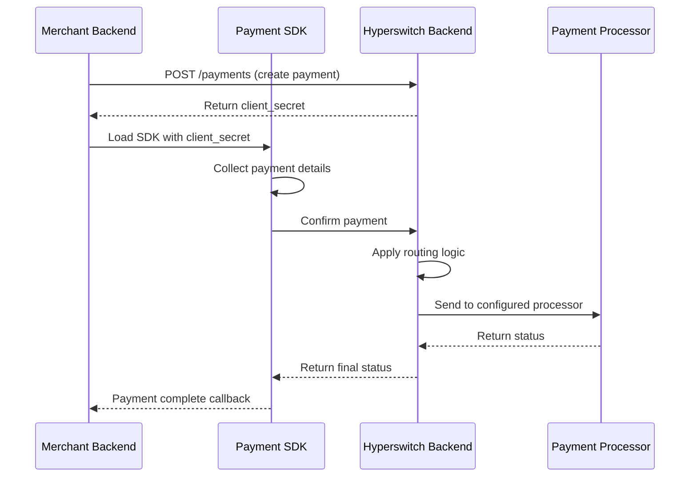
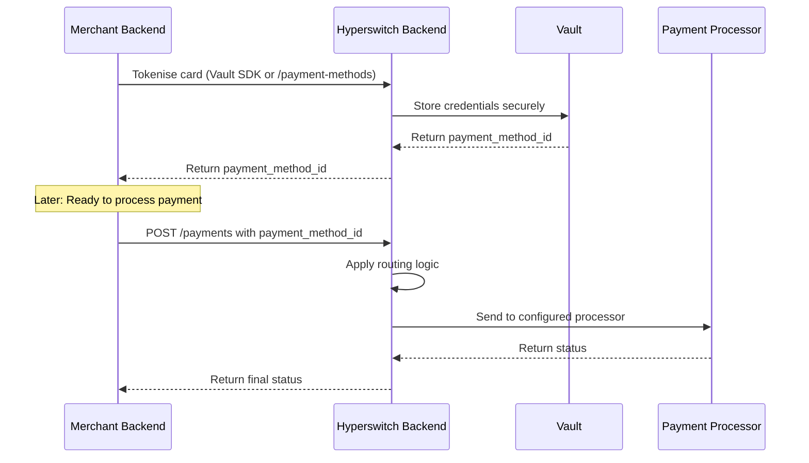

# Payments Suite

**TL;DR:** Juspay Hyperswitch gives you four modular components—SDK, Orchestration, Connectors, and Vault—that you can mix and match based on your compliance needs, performance requirements, and engineering capabilities. Choose between Client-Side SDK Payments for rapid implementation or Server-to-Server (S2S) Payments for granular control.

---

## What is the Hyperswitch Payments Suite?

Hyperswitch is built for teams that want engineering-grade control over payments. Rather than forcing you into a single architecture, it offers four independent building blocks that you can configure based on your specific requirements.

You decide who owns each component: Hyperswitch manages it, you self-host it, or you use a third-party provider. This flexibility lets you design an architecture aligned with your compliance posture, performance requirements, and internal engineering capabilities.

---

## What are the Four Core Components?

| Component | Role | Ownership Options |
|-----------|------|-------------------|
| **SDK (Frontend)** | Entry point for your payment flow; securely captures sensitive payment information | Hyperswitch-hosted or self-hosted |
| **Intelligent Routing & Orchestration (Backend)** | Manages payment lifecycle, executes routing logic, handles post-payment operations like refunds | Hyperswitch Cloud or self-hosted |
| **Acquirer & Processor Connectivity (Connectors)** | Pipeline that translates transactions to payment processors (e.g., Stripe, Adyen, Worldpay) | Hyperswitch-managed connectors |
| **Vault (Card Data Storage)** | Secure storage for card data enabling one-click and recurring payments | Hyperswitch Vault, external vault, or self-hosted |

### How do the components work together?

Each component operates independently but integrates seamlessly. For example, you might use Hyperswitch's SDK and Orchestration whilst connecting your own external vault for card data storage. This modular approach means you can adopt Hyperswitch incrementally without rewriting your entire payments infrastructure.

**External vault integration:** You can connect external vaults to Hyperswitch orchestration if you need to maintain your existing card data storage. See [Connect External Vaults to Hyperswitch Orchestration](https://docs.hyperswitch.io/explore-hyperswitch/workflows/vault/connect-external-vaults-to-hyperswitch-orchestration) for details.

---

## Which Integration Model Should You Choose?

The key decision is: **Who controls the payment execution?**

| Integration Model | Execution Control | Tokenisation Timing | Best For |
|------------------|-------------------|---------------------|----------|
| **Client-Side SDK Payments** | SDK-initiated | Post-payment | Rapid checkout, frontend-driven experiences |
| **Server-to-Server (S2S) Payments** | Backend-controlled | Pre-payment | Granular control, complex orchestration |

---

## How does Client-Side SDK Payments work?

**When to choose this model:**
- You want dynamic, frontend-driven payment experiences
- You prefer minimal backend orchestration logic
- You want SDK-triggered payment confirmation
- You are optimising for rapid checkout implementation

**Prerequisites:**
- Hyperswitch account with API keys
- Payment processor configured in your dashboard
- Frontend application capable of loading the SDK

### Flow diagram

### Implementation steps

1. **Create a payment:** Call the [`/payments`](https://api-reference.hyperswitch.io/v1/payments/payments--create) API from your backend to create a payment and receive a `client_secret`.

2. **Load the SDK:** Initialise the [Payment SDK](https://docs.hyperswitch.io/explore-hyperswitch/payment-experience/payment) in your frontend with the `client_secret`.

3. **Collect payment details:** The SDK securely collects the customer's payment information.

4. **Confirm payment:** The SDK triggers payment confirmation and communicates with Hyperswitch backend.

5. **Hyperswitch processes:** Hyperswitch applies [routing logic](https://docs.hyperswitch.io/explore-hyperswitch/workflows/intelligent-routing), sends the request to the configured payment service provider (PSP), manages authorisation and capture, and returns the final payment status.

---

## How does Server-to-Server (S2S) Payments work?

**When to choose this model:**
- You want granular control over transaction timing
- You require backend-driven orchestration logic
- You want to tokenise credentials before execution
- You prefer decoupling vaulting from transaction processing

**Prerequisites:**
- Hyperswitch account with API keys
- Payment processor configured in your dashboard
- Backend application with server-side capabilities

### Flow diagram

### Implementation steps

#### Step 1: Tokenise the card

Tokenise payment credentials using one of these methods:
- **Vault SDK:** Use the [Vault SDK](https://docs.hyperswitch.io/explore-hyperswitch/payment-experience/payment-method/web) in your frontend
- **Backend API:** Call [`/payment-methods`](https://api-reference.hyperswitch.io/v2/payment-methods/payment-method--create-v1) from your backend

Hyperswitch securely stores the credential and returns a reusable identifier: `payment_method_id`.

#### Step 2: Trigger payment execution

You have two options for processing the payment:

**Option A: Process via Hyperswitch Orchestration**

Call the `/payments` API with your `payment_method_id`. Choose this option if you want Hyperswitch to:
- Apply [routing logic](https://docs.hyperswitch.io/explore-hyperswitch/workflows/intelligent-routing)
- Select the optimal connector
- Manage [retries](https://docs.hyperswitch.io/explore-hyperswitch/workflows/smart-retries) and failover
- Handle authorisation and capture lifecycle

This is the recommended model for merchants adopting Hyperswitch orchestration.

**Option B: Process via Proxy API**

Call the [`/proxy`](https://docs.hyperswitch.io/about-hyperswitch/payment-suite-1/payment-method-card/proxy) API. Choose this option if:
- You do not want to change your existing PSP integration immediately
- You want Hyperswitch to act as a passthrough layer
- You are incrementally migrating to full orchestration

In this mode:
- Your existing integration contract remains unchanged
- Hyperswitch forwards requests to the configured processor
- You can progressively enable routing and orchestration features

---

## How do you choose between the integration models?

Use this decision matrix to select the right model for your use case:

| Your Requirement | Recommended Model |
|-----------------|-------------------|
| Fastest time to market | Client-Side SDK |
| Frontend-driven checkout | Client-Side SDK |
| Minimal backend changes | Client-Side SDK |
| Need to tokenise before payment | S2S Payments |
| Complex orchestration logic | S2S Payments |
| Incremental migration from existing PSP | S2S with Proxy API |
| Full orchestration adoption | S2S with Orchestration |

---

## What's next?

- **Get started:** [Sign up](https://app.hyperswitch.io/) and try a test payment
- **Integration guide:** Follow the [step-by-step integration guide](https://docs.hyperswitch.io/hyperswitch-cloud/integration-guide)
- **API reference:** Explore the [full API documentation](https://api-reference.hyperswitch.io/introduction)
- **Configure routing:** Set up [intelligent routing](https://docs.hyperswitch.io/explore-hyperswitch/workflows/intelligent-routing) for your connectors

---

## Need help?

Join our [Slack Community](https://inviter.co/hyperswitch-slack) to ask questions, share feedback, and collaborate with other developers. For direct support, use our [Contact Us](https://hyperswitch.io/contact-us) page.
