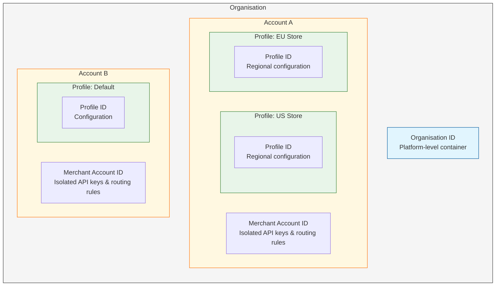

# SaaS Platforms

### TL;DR

Juspay hyperswitch is an open-source payment orchestration platform that helps SaaS platforms scale multi-tenant payment infrastructure. It provides connector abstraction, hierarchical tenant isolation, and unified operations. You can onboard accounts programmatically, support BYOP (Bring Your Own Processor), and maintain unified observability across all connected payment providers.

***

### Why do you struggle with multi-tenant payments?

As a SaaS platform, you face a unique challenge: you must act as the central nervous system for thousands of distinct accounts. A recurring friction exists between scalability (standardising payments) and flexibility (allowing accounts to bring their own processors). Juspay hyperswitch resolves this by providing a composable payment mesh that standardises these differences without requiring custom engineering for each account.

The sections below outline the architectural patterns required to scale a multi-tenant payment infrastructure.

***

### How do you understand the platform hierarchy?

Juspay hyperswitch provides a built-in hierarchy designed specifically for multi-tenant platforms. Understanding this model is essential before implementing your integration.



**Hierarchy Levels:**

| Level | Purpose | Benefit |
|-------|---------|---------|
| **Organisation** | Top-level container for your platform | Centralised governance and billing |
| **Account** | Individual merchant/tenant entity | Isolates API keys and routing rules |
| **Profile** | Business unit segmentation | Manages regional splits (e.g., "Account A — US Store" vs "Account A — EU Store") |

**Key Terminology:**

*   **BYOP (Bring Your Own Processor)**: A model where tenants use their own payment processor credentials rather than the platform's.
*   **MoR (Merchant of Record)**: A liability model where the SaaS platform holds funds and manages compliance.
*   **Connected Account**: A liability model where the individual tenant holds funds and manages their own compliance.

**Reference**: [Platform Org and Merchant Setup](https://docs.hyperswitch.io/explore-hyperswitch/account-management/multiple-accounts-and-profiles/platform-org-and-merchant-setup)

***

### How do you support high-value accounts that demand their own processors?

High-value accounts often refuse to migrate their payment processing to your SaaS platform because they have pre-negotiated rates or historical data with specific providers. Supporting these "brownfield" accounts usually requires building and maintaining dozens of custom integrations.

Juspay hyperswitch acts as a Connector Abstraction Layer. You integrate our checkout once, and we dynamically route the transaction to the account's preferred processor based on their configuration.

| Feature | Description | Reference |
|---------|-------------|-----------|
| Unified API | Normalises 100+ processor APIs into a single Payment Intent Flow | [Payment Intent Flow](https://api-reference.hyperswitch.io/v1/payments/payments--create#payments-create) |
| Configuration-Driven Integration | New processors added via configuration, not code | [Supported Connectors](https://juspay.io/integrations) |
| Deployment Model | Self-hosted (run in your infrastructure) or SaaS (managed by Juspay) | [Deployment Options](https://docs.hyperswitch.io/explore-hyperswitch/account-management/self-managed-deployment) |
| Integration Model | SDK (embedded checkout UI) or API (backend-only integration) | [Platform Capabilities](https://docs.hyperswitch.io/explore-hyperswitch) |

> **SDK vs API: Which should you choose?**
> *   Use the **SDK** when you want a pre-built, customisable checkout UI with reduced frontend development.
> *   Use the **API** when you need full control over the payment UI or are building a headless/integration-only solution.

***

### How do you ensure data isolation between accounts?

You must ensure that one account's routing rules, API keys, and customer data never leak to another. Building this "tenancy logic" from scratch is risky and delays time-to-market.

Juspay hyperswitch provides a built-in [Organisation → Account → Profile](https://docs.hyperswitch.io/explore-hyperswitch/account-management/multiple-accounts-and-profiles) data model designed specifically for platforms.

**Platform Setup Capabilities:**

*   **Hierarchical Organisations**: Configure organisations with programmatic merchant onboarding. See [Platform Org and Merchant Setup](https://docs.hyperswitch.io/explore-hyperswitch/account-management/multiple-accounts-and-profiles/platform-org-and-merchant-setup).
*   **Granular Control**: Isolate API keys and routing rules at the Account ID level.
*   **Team Access**: Map your control centre users to specific levels of the hierarchy using our [User Management](https://docs.hyperswitch.io/explore-hyperswitch/account-management/manage-your-team) controls.

***

### How do you onboard accounts programmatically?

Manual onboarding via a control centre is an operational bottleneck. To scale, platforms need to provision sub-accounts, inject credentials, and configure webhooks programmatically at the moment of signup.

Treat account onboarding as an API call, not a support ticket. Juspay hyperswitch exposes [Management APIs](https://api-reference.hyperswitch.io/v1/merchant-account/merchant-account--create#merchant-account-create) to fully automate the lifecycle.

| Capability | Description | API Reference |
|------------|-------------|---------------|
| Instant Onboarding | Create a new account entity and inject their processor API keys | [Connector Configuration API](https://api-reference.hyperswitch.io/v1/merchant-connector-account/merchant-connector--create#merchant-connector-create) |
| Flexible Liability | Support MoR models (platform holds funds) and Connected Account models (account holds funds) | [Account Management](https://docs.hyperswitch.io/explore-hyperswitch/account-management/multiple-accounts-and-profiles) |

#### Quick Start: Onboard a New Account

Follow these steps to programmatically onboard a new merchant account:

1.  **Get your Admin API Key** — Required for all management operations. Generate this in your Juspay hyperswitch dashboard.
2.  **Create an Organisation** (if not already created) — Use the Organisation API to establish your platform container.
3.  **Create a Merchant Account** — Use the endpoint below to create the tenant account.
4.  **Generate Merchant API Key** — Create API credentials for the new account to process payments.
5.  **Configure Webhooks** — Set up webhook endpoints to receive payment events.
6.  **Connect a Processor** — Configure the payment processor using the Connector API.

#### Example: Create a Merchant Account

```bash
# Note: Use sandbox endpoint for testing
# Required header: api-key (your Admin API Key, NOT Merchant API Key)
# Optional header: x-idempotency-key (recommended for retries)

curl --request POST \
  --url https://sandbox.hyperswitch.io/merchant_accounts \
  --header 'api-key: YOUR_ADMIN_API_KEY' \
  --header 'content-type: application/json' \
  --header 'x-idempotency-key: idempotency_key_123' \
  --data '{
    "merchant_id": "merchant_abc123",
    "merchant_name": "Acme Store",
    "organization_id": "org_your_platform_123",
    "primary_business_details": {
      "product_category": "Software",
      "business_type": "Digital Services"
    },
    "merchant_details": {
      "primary_contact_person": "John Doe",
      "primary_email": "john@acmestore.com",
      "primary_phone": "+1-555-0123"
    },
    "metadata": {
      "saas_tenant_id": "tenant_456",
      "onboarded_via": "api"
    }
  }'
```

**Example Response (201 Created):**

```json
{
  "merchant_id": "merchant_abc123",
  "merchant_name": "Acme Store",
  "organization_id": "org_your_platform_123",
  "merchant_details": {
    "primary_contact_person": "John Doe",
    "primary_email": "john@acmestore.com",
    "primary_phone": "+1-555-0123"
  },
  "publishable_key": "pk_dev_xxxxxxxxxxxxxxxx",
  "created_at": "2024-01-15T10:30:00Z",
  "modified_at": "2024-01-15T10:30:00Z",
  "metadata": {
    "saas_tenant_id": "tenant_456",
    "onboarded_via": "api"
  }
}
```

#### Common Errors

| HTTP Status | Error Code | Description | Resolution |
|-------------|------------|-------------|------------|
| 400 | `InvalidRequestError` | Missing required field (`organization_id`, `merchant_id`, etc.) | Check payload against schema |
| 401 | `Unauthorized` | Invalid or missing Admin API Key | Use valid Admin API Key, not Merchant API Key |
| 409 | `Conflict` | Merchant ID already exists | Use unique `merchant_id` or include idempotency key |
| 422 | `Unprocessable` | Invalid field format | Verify email format, phone format, etc. |

> **Try it in sandbox:** Use `https://sandbox.hyperswitch.io` for testing. See our [Sandbox Guide](https://docs.hyperswitch.io/explore-hyperswitch/account-management/sandbox-environment) for details.

#### Post-Creation Steps

After creating the merchant account, complete these steps before processing payments:

1.  **Generate API Keys**:
    ```bash
    curl --request POST \
      --url https://sandbox.hyperswitch.io/api_keys \
      --header 'api-key: YOUR_ADMIN_API_KEY' \
      --header 'content-type: application/json' \
      --data '{
        "merchant_id": "merchant_abc123",
        "name": "Production API Key"
      }'
    ```

2.  **Configure Webhooks**:
    ```bash
    curl --request POST \
      --url https://sandbox.hyperswitch.io/webhook_endpoints \
      --header 'api-key: YOUR_ADMIN_API_KEY' \
      --header 'content-type: application/json' \
      --data '{
        "merchant_id": "merchant_abc123",
        "url": "https://your-platform.com/webhooks/hyperswitch",
        "events": ["payment_succeeded", "payment_failed", "refund_succeeded"]
      }'
    ```

3.  **Connect a Payment Processor** (Stripe example):
    ```bash
    curl --request POST \
      --url https://sandbox.hyperswitch.io/merchant_connector_accounts \
      --header 'api-key: YOUR_ADMIN_API_KEY' \
      --header 'content-type: application/json' \
      --data '{
        "merchant_id": "merchant_abc123",
        "connector_name": "stripe",
        "connector_account_details": {
          "auth_type": "HeaderKey",
          "api_key": "sk_test_xxxxxxxx"
        },
        "connector_type": "payment_processor"
      }'
    ```

***

### How do you standardise complex payment flows across processors?

Different verticals require different flows (e.g., $0 Auth for hotels, 3D Secure for EU retail, recurring for subscriptions). Fragmentation across PSP capabilities (e.g., some processors support 3D Secure, others do not) often forces platforms to write "spaghetti code."

Juspay hyperswitch normalises complex flows into a standard state machine. Your frontend handles a single response type, regardless of the underlying complexity.

| Feature | Description | Reference |
|---------|-------------|-----------|
| Compliance Ready | Automatically handles 3D Secure (3DS) challenges across all supporting processors | [3D Secure (3DS)](https://docs.hyperswitch.io/explore-hyperswitch/merchant-controls/payment-features/3d-secure-3ds) |
| Unified Lifecycle | Perform authorisation, capture, and void operations using a single API syntax | [Connector Payment Flows](https://docs.hyperswitch.io/learn-more/hyperswitch-architecture/connector-payment-flows) |

> **3D Secure (3DS)**: An authentication protocol used by card issuers to verify cardholder identity for online transactions, commonly required in the European Economic Area (EEA) for strong customer authentication (SCA) compliance.

***

### How do you help accounts avoid vendor lock-in with their saved cards?

If an account stores card data in a PSP-specific vault (e.g., a processor-specific Customer ID), they are vendor-locked. Switching providers means losing all saved customer cards, which destroys recurring revenue.

Use the [Payment Vault](https://docs.hyperswitch.io/explore-hyperswitch/payment-orchestration/quickstart/tokenization-and-saved-cards) to provide accounts with processor-independent token storage.

| Benefit | Description |
|---------|-------------|
| Ownership | You or the account own the tokens, not the PSP. |
| Interoperability | A card saved during a transaction on one processor can be seamlessly charged via another processor later. |
| Security | Offload PCI-DSS compliance by using certified secure storage. |

**Reference**: [Network Tokenisation](https://docs.hyperswitch.io/explore-hyperswitch/payment-orchestration/quickstart/tokenization-and-saved-cards/network-tokenisation)

***

### How do you simplify support workflows across multiple providers?

Support teams struggle when every PSP returns different error codes (e.g., "Do Not Honour" vs "Refusal" vs "Error 402"). Debugging requires deep knowledge of 10+ different vendor systems.

Juspay hyperswitch translates the chaos of vendor responses into a clean, standardised language for your support and engineering teams.

| Capability | Description | Reference |
|------------|-------------|-----------|
| Unified Errors | Maps thousands of PSP error codes into a standardised error reference (e.g., `card_expired`) | [Error Codes](https://docs.hyperswitch.io/explore-hyperswitch/payment-experience/payment/web/error-codes) |
| Single Source of Truth | View transaction logs, refunds, and disputes across all accounts and processors in one view | [Analytics and Operations](https://docs.hyperswitch.io/explore-hyperswitch/account-management/analytics-and-operations) |

***

### How do you build unified operational interfaces for refunds, disputes, and webhooks?

The payment lifecycle does not end at checkout. You must also build portals for your accounts to handle refunds, disputes, and webhooks. Building these operational interfaces is painful because every processor has a different API schema for refunds and a different JSON payload for webhooks.

Juspay hyperswitch standardises the chaotic "Day 2" operations into a clean, unified interface. Your engineering team builds one refund handler and one webhook listener, and it works for all connected processors.

| Feature | Description | Reference |
|---------|-------------|-----------|
| Universal Webhooks | Ingests disparate events and transforms them into a standardised webhook schema | [Webhooks](https://docs.hyperswitch.io/explore-hyperswitch/payment-orchestration/quickstart/webhooks) |
| Dispute Management | Normalises the disputes lifecycle so you can surface evidence submission flows in your SaaS control centre | [Disputes](https://docs.hyperswitch.io/explore-hyperswitch/account-management/disputes) |
| Stateless Operations | Trigger refunds or voids using Relay APIs, even if the original payment was not processed through Juspay hyperswitch | [Relay APIs](https://api-reference.hyperswitch.io/v1/relay/relay#relay-create) |

***

### How do you maintain payment uptime during processor outages?

Global SaaS platforms cannot afford downtime. When a processor in a specific region experiences latency or outages, your accounts blame you, not the processor. Without granular visibility into processor performance, your engineering team is flying blind, unable to reroute traffic or uphold SLAs for Enterprise accounts.

Juspay hyperswitch treats payments as critical infrastructure and provides deep visibility into the health of your payment mesh, allowing you to proactively manage reliability.

| Feature | Description | Reference |
|---------|-------------|-----------|
| Connector Health | Continuously monitors success rates and latency of every connected processor | [Smart Router](https://docs.hyperswitch.io/explore-hyperswitch/workflows/intelligent-routing) |
| Automatic Failover | Routes transactions to healthy alternatives when a processor degrades (requires Smart Router configuration) | [Smart Router](https://docs.hyperswitch.io/explore-hyperswitch/workflows/intelligent-routing) |
| OpenTelemetry | Emits standard OTel traces for every request; pipe into Datadog, Prometheus, or Grafana | [Monitoring](https://github.com/juspay/hyperswitch/blob/main/docs/architecture.md#monitoring) |
| System Status | Access the System Health API to build internal status pages for your support team | [System Health API](https://live.hyperswitch.io/api/health) |

> **Note on Automatic Failover**: Automatic failover requires configuration of routing rules through the Smart Router. See the [Intelligent Routing documentation](https://docs.hyperswitch.io/explore-hyperswitch/workflows/intelligent-routing) for setup instructions.

***

### What's next?

Ready to get started? Here are the next steps:

*   [Set up multiple accounts and profiles](https://docs.hyperswitch.io/explore-hyperswitch/account-management/multiple-accounts-and-profiles) — Configure your platform hierarchy
*   [Configure intelligent routing](https://docs.hyperswitch.io/explore-hyperswitch/workflows/intelligent-routing) — Set up smart routing rules for your accounts
*   [Configure smart retries](https://docs.hyperswitch.io/explore-hyperswitch/payment-orchestration/smart-retries) — Improve authorisation rates automatically
*   [Implement webhooks](https://docs.hyperswitch.io/explore-hyperswitch/payment-orchestration/quickstart/webhooks) — Listen for payment events across all processors
*   [View supported connectors](https://juspay.io/integrations) — See the full list of integrated payment providers
*   [Try it in sandbox](https://docs.hyperswitch.io/explore-hyperswitch/account-management/sandbox-environment) — Test your integration without touching production
